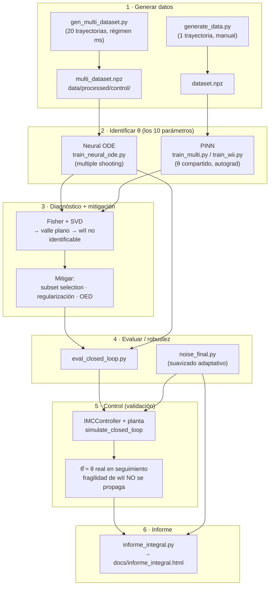
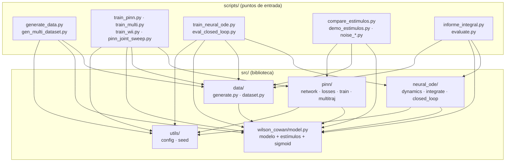

# P0 — Arquitectura general y flujo de datos

> **En una frase:** cómo está armado el repo `wilson-cowan-id` — qué es biblioteca y qué es punto de entrada, cómo se encadenan los pasos (generar datos → identificar con Neural ODE/PINN → evaluar → controlar → informe) y dónde tocar cada cosa.

Este es el **mapa** del código, la puerta de entrada al manual. Los otros documentos entran en cada módulo: [[P1_wilson_cowan]] (el modelo), [[P2_data]] (datasets), [[P3_pinn]] (la PINN), [[P4_neural_ode]] (el Neural ODE y el control), [[P5_utils]] (config y semillas) y [[P6_scripts]] (los scripts que se corren).

---

## 1. `src/` vs `scripts/` — la regla mental

El repo separa **dos tipos de código** y conviene tenerlo claro desde el primer día, porque es la convención que organiza todo lo demás:

- **`src/` es la biblioteca.** Define las *herramientas*: el modelo de Wilson-Cowan, la librería de estímulos, la PINN, el Neural ODE, el controlador, los utilitarios. Es código **reutilizable** que **no se corre directo** — se importa. Pensalo como una caja de herramientas: acá viven las clases y funciones, pero por sí solas no "hacen" nada.

- **`scripts/` son los puntos de entrada.** Cada archivo es algo que **se corre** con `python scripts/<x>.py`. Un script *usa* las herramientas de `src/` para lograr un objetivo concreto: generar un dataset, entrenar un modelo, evaluar un checkpoint, armar un informe. Acá vive la parte "editable" de cada experimento (parámetros, qué trayectorias, qué barrido).

> **Regla mental:** **`src/` define las herramientas; `scripts/` las usa.** Si estás definiendo *cómo funciona* algo (una nueva sigmoidea, una nueva pérdida, un nuevo integrador) → va en `src/`. Si estás decidiendo *qué querés correr hoy* (con qué parámetros, qué estímulo, cuántas trayectorias) → va en `scripts/`.

Este patrón es estándar en proyectos científicos serios: mantener la lógica separada de los experimentos hace que la biblioteca sea testeable y que los scripts sean desechables/reproducibles sin ensuciar el núcleo.

---

## 2. Árbol de carpetas comentado

```text
wilson-cowan-id/
├── src/                          ← LA BIBLIOTECA (lógica reutilizable, no se corre directo)
│   ├── wilson_cowan/
│   │   ├── model.py              ← el modelo WC (rhs, simulate) + librería de estímulos + sigmoid + plot
│   │   └── __init__.py           ← acá se exportan los estímulos nuevos
│   ├── data/
│   │   ├── generate.py           ← generate_dataset (simula 1 trayectoria) + save/load .npz
│   │   └── dataset.py            ← WilsonCowanDataset (envoltorio torch.Dataset)
│   ├── pinn/
│   │   ├── network.py            ← PINN: red t→[I,E] con Fourier features + pesos a identificar
│   │   ├── losses.py             ← data_loss, physics_loss (autograd), initial_condition_loss
│   │   ├── train.py              ← TrainConfig + Trainer (una trayectoria)
│   │   └── multitraj.py          ← MultiTrajPINN + trainer (N redes, θ compartido) → rompe wII
│   ├── neural_ode/
│   │   ├── dynamics.py           ← GrayBoxWC: f(x,P,Q) white-box / gray-box
│   │   ├── integrate.py          ← rk4_step, rollout: integrador RK4 diferenciable
│   │   └── closed_loop.py        ← IMCController + plantas + simulate_closed_loop + referencias
│   └── utils/
│       ├── config.py             ← load_config (lee YAML)
│       └── seed.py               ← set_seed, set_plot_style
│
├── scripts/                      ← PUNTOS DE ENTRADA (se corren: python scripts/<x>.py)
│   ├── generate_data.py          ← genera 1 trayectoria (panel de control manual)
│   ├── gen_multi_dataset.py      ← dataset de control multi-variante (20 trayectorias) → Neural ODE
│   ├── train_pinn.py             ← PINN una trayectoria (forward / inverso estable / ignorante)
│   ├── train_multi.py            ← PINN multi-trayectoria (θ compartido) → recupera wII
│   ├── pinn_joint_sweep.py       ← PINN conjunta, barrido de ruido
│   ├── train_wii.py              ← experimento dedicado a wII (diseño Q-grande)
│   ├── compare_estimulos.py      ← compara familias de estímulo por error paramétrico
│   ├── demo_estimulos.py         ← cobertura del espacio de estados por estímulo
│   ├── graficos_estimulos.py     ← gráficos antes vs ahora de los estímulos
│   ├── train_neural_ode.py       ← entrena Neural ODE (multiple shooting)
│   ├── eval_closed_loop.py       ← corre el lazo cerrado (planta verdadera vs aprendida, θ real vs θ̂)
│   ├── noise_sweep.py            ← barrido de ruido PINN (dos etapas + FD)
│   ├── noise_robustness.py       ← ruido en la cadena Neural ODE → control
│   ├── noise_improve.py          ← qué palanca mejora θ̂ a ruido alto
│   ├── noise_refine.py           ← refinamiento del suavizado a ruido alto
│   ├── noise_final.py            ← barrido final, suavizado adaptativo (mejor resultado)
│   ├── informe_neural_ode.py     ← informe: simulador vs Neural ODE
│   ├── informe_integral.py       ← INFORME INTEGRAL de todo → docs/informe_integral.html
│   └── evaluate.py               ← evaluación/figuras de un checkpoint
│
├── configs/
│   └── default.yaml              ← parámetros del modelo, estímulos, datos, PINN, entrenamiento
├── data/
│   ├── raw/                      ← datos crudos
│   └── processed/                ← datasets listos (.npz), incl. control/multi_dataset.npz
├── results/
│   ├── figures/                  ← figuras generadas
│   └── models/                   ← checkpoints (.pt)
├── notebooks/                    ← exploración y figuras
├── docs/                         ← estructura_codigo.md, informe_integral.html, etc.
├── tests/                        ← tests con pytest
├── pyproject.toml                ← metadatos del proyecto + config de pytest
├── requirements.txt              ← dependencias con versiones fijadas
└── README.md                     ← objetivo y uso básico
```

---

## 3. El pipeline completo

De datos sintéticos a control validado. Esta es la columna vertebral del proyecto: se generan datos, se **identifican** los 10 parámetros de WC (con Neural ODE y, en paralelo, con PINN), se **diagnostica** qué se recupera y qué no (Fisher + SVD → `wII` es el cuello de botella), se **mitiga**, y finalmente se **valida orientado al control** (el modelo identificado alimenta un controlador IMC en lazo cerrado).



> **Cómo leerlo:** las dos ramas de identificación (Neural ODE y PINN) son **caminos paralelos** hacia lo mismo — recuperar θ. El diagnóstico Fisher+SVD explica *por qué* `wII` cuesta; la mitigación (multi-trayectoria, regularización, diseño de estímulo/OED) lo ataca. La validación por control es el cierre: aunque `wII` quede mal estimado, el lazo cerrado sigue funcionando. Ver [[P6_scripts]] para el detalle de cada script.

---

## 4. Dependencias entre módulos

Quién importa a quién. Los **scripts** (arriba) consumen la **biblioteca** `src/` (abajo). Ningún módulo de `src/` importa a un script; el flujo de dependencias va siempre en una dirección.



> **Observación clave:** `wilson_cowan/model.py` es el **corazón** del que todo depende. `data`, `pinn` y `neural_ode` lo usan (para simular, para armar el residuo físico, para las ecuaciones del gray-box). `utils` es transversal (config y semillas). Esto explica por qué [[P1_wilson_cowan]] es el documento del que conviene arrancar la lectura técnica.

---

## 5. Infraestructura: configs, pyproject, requirements, tests

### `configs/` — los YAML
Los archivos de configuración (`default.yaml`) centralizan **todo lo que se toca sin cambiar código**: la semilla, los 10 parámetros del modelo, los estímulos (P→E, Q→I con amplitud y t_on/t_off), la generación de datos (t_span, condiciones iniciales, tolerancias del integrador, `n_eval`, `noise_std`), la arquitectura de la PINN (`hidden_dim`, `n_layers`) y el entrenamiento (`epochs`, `lr`, pesos de las pérdidas, `n_collocation`). Se leen con `load_config` (ver [[P5_utils]]). La idea: **un experimento reproducible = código fijo + un YAML**.

### `pyproject.toml` — metadatos y pytest
Declara el proyecto (nombre, versión, `requires-python >=3.10`) y configura **pytest**: `pythonpath = ["."]` (para que los tests importen `src/` sin instalar el paquete) y `testpaths = ["tests"]`. Es el archivo estándar moderno de empaquetado en Python.

### `requirements.txt` — dependencias clave
Versiones **fijadas** (alineadas al entorno del repo, Python 3.12.3). Las que importan conceptualmente:

| Paquete | Para qué en este proyecto |
|---|---|
| **numpy** | arrays y álgebra de base (todo lo numérico) |
| **scipy** | integración de ODEs de referencia (el `simulate` "tipo ode45"), filtros de suavizado |
| **torch** | redes, autograd (derivadas del residuo físico), optimización de la PINN y el Neural ODE |
| **torchdiffeq** | solvers de ODEs diferenciables para Neural ODE (backprop a través del integrador) |
| **matplotlib** | todas las figuras (series, retratos de fase, elipses SVD, etc.) |

(Además: `pandas`, `scikit-learn`, `PyYAML` para los configs, `tqdm`, `pytest`, y `jupyter`/`ipykernel` para los notebooks.)

### `tests/`
Pruebas con **pytest**. Sirven para que la biblioteca no se rompa en silencio: que el modelo integre bien, que las pérdidas tengan la forma correcta, que los estímulos devuelvan lo esperado. Se corren con `pytest` desde la raíz (gracias al `pythonpath` del `pyproject.toml`).

> **Nota de estado:** el README marca el repo como *scaffold* con partes en `NotImplementedError`/`TODO`. La estructura y las convenciones descritas acá son la referencia estable; algunos detalles de implementación puntual pueden estar en progreso.

---

## 6. Dónde tocar para…

| Querés… | Andá a… | Documento |
|---|---|---|
| **Agregar un estímulo nuevo** | Definir el generador `f(t)` en `src/wilson_cowan/model.py` **y** exportarlo en `src/wilson_cowan/__init__.py` | [[P1_wilson_cowan]] |
| **Cambiar qué trayectorias se generan** | La `ZONA EDITABLE` de `scripts/gen_multi_dataset.py` (o el script de identificación que uses) | [[P6_scripts]] |
| **Cambiar la arquitectura de la PINN** | `src/pinn/network.py` (capas, Fourier features) | [[P3_pinn]] |
| **Cambiar la arquitectura del Neural ODE** | `src/neural_ode/dynamics.py` (`GrayBoxWC`, corrección neuronal, white/gray-box) | [[P4_neural_ode]] |
| **Cambiar el controlador** | `src/neural_ode/closed_loop.py` (`IMCController`) | [[P4_neural_ode]] |
| **Cambiar hiperparámetros de entrenamiento** | `TrainConfig` (PINN) o la `ZONA EDITABLE` del script; para lo global, `configs/default.yaml` | [[P3_pinn]] · [[P5_utils]] |
| **Cambiar los 10 parámetros del modelo o los estímulos por defecto** | `configs/default.yaml` (bloques `model` y `stimulus`) | [[P5_utils]] |

---

## Para seguir

- **La biblioteca, módulo por módulo:** [[P1_wilson_cowan]] · [[P2_data]] · [[P3_pinn]] · [[P4_neural_ode]] · [[P5_utils]]
- **Los scripts (qué correr y en qué orden):** [[P6_scripts]]
- **Teoría por código (los PDF):** M5 y M6 (métodos numéricos / SciML y optimización), B3 (modelo de Wilson-Cowan), B5 (régimen theta-gamma y optogenética).
