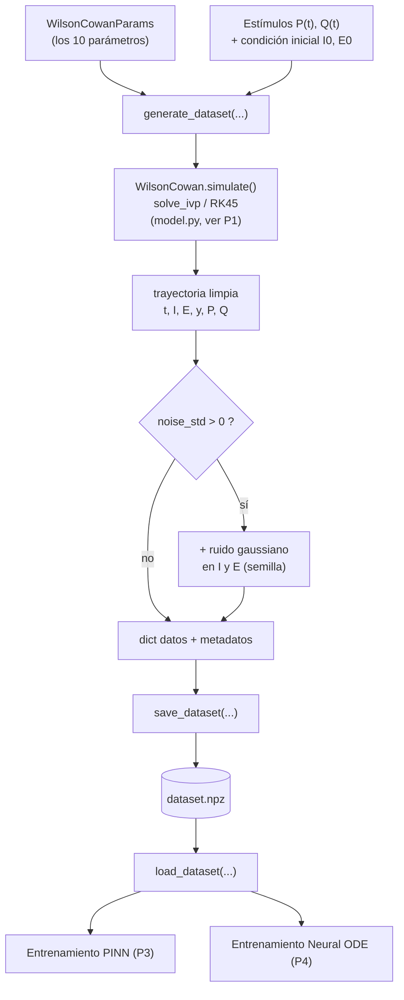

# P2 — `src/data` — generación y datasets

> Manual del código del subpaquete `src/data/` del proyecto Wilson-Cowan. Documentamos lo que **realmente** hay en el repo, archivo por archivo y función por función. Cuando algo es un *stub* (esqueleto sin implementar) lo decimos explícitamente.

`src/data/` es la **fábrica de datos sintéticos** del proyecto. Su trabajo es simular trayectorias del modelo de Wilson-Cowan (WC) y dejarlas guardadas en disco para que después las consuman los entrenamientos: la **PINN** (ver P3) y la **Neural ODE** (ver P4). Toda la identificación de parámetros parte de datos que salen de acá.

Tres archivos:

| Archivo | Rol |
|---|---|
| `generate.py` | Lógica reutilizable: simula **una** trayectoria, la empaqueta como `dict`, la guarda/carga en `.npz`. |
| `dataset.py` | Envoltorio tipo `torch.utils.data.Dataset` para alimentar PyTorch. **Hoy es un stub** (`NotImplementedError`). |
| `__init__.py` | Reexporta los símbolos públicos del subpaquete. |

---

## Dónde encaja en el pipeline (P0)

El flujo es: **parámetros + estímulos → simulación (integrador) → trayectoria con (opcional) ruido → `.npz` en disco → entrenamiento**.



Un detalle práctico: `generate.py` es la **lógica**; los valores que se tocan a mano (cuánto tiempo simular, qué `P` y `Q`, cuánto ruido, qué semilla) viven centralizados en el "panel de control" `scripts/generate_data.py`, que llama a estas funciones. Para generar *muchos* datasets a la vez está `scripts/gen_multi_dataset.py`.

---

## `generate.py`

**Imports clave** (de `src.wilson_cowan`, documentado en P1):
- `WilsonCowan` — la clase del modelo (arma el sistema y lo integra con `solve_ivp`).
- `WilsonCowanParams` — contenedor de los 10 parámetros ($w_{EE}, w_{EI}, w_{IE}, w_{II}, \tau_e, \tau_i, a_e, a_i, \theta_e, \theta_i$).
- `zero_input` — función de estímulo nula (`P(t)=0` para todo `t`), usada como valor por defecto.

Tres funciones: `generate_dataset` (simula), `save_dataset` (guarda) y `load_dataset` (carga).

### `generate_dataset(...)`

**Firma**

```python
def generate_dataset(
    params: WilsonCowanParams,
    P: Callable[[float], float] = zero_input,
    Q: Callable[[float], float] = zero_input,
    I0: float = 0.0,
    E0: float = 0.0,
    t_span: tuple[float, float] = (0.0, 600.0),
    n_eval: int = 6000,
    noise_std: float = 0.0,
    seed: int | None = None,
    rel_tol: float = 1e-3,
    abs_tol: float = 1e-6,
) -> dict[str, np.ndarray]:
```

**Qué hace.** Simula **UNA** trayectoria completa del modelo WC, forzada por los estímulos `P` (a la población excitatoria E) y `Q` (a la inhibitoria I), y la devuelve empaquetada como diccionario de arrays de NumPy. Un "dato" no es un punto suelto: es la trayectoria entera, o sea muchos pares $(t_k, [I(t_k), E(t_k)])$ sobre una grilla uniforme de tiempos. Opcionalmente le suma ruido de observación para simular una medición imperfecta.

Internamente hace cuatro pasos:
1. **Arma el modelo**: `WilsonCowan(params=params, P=P, Q=Q)`.
2. **Grilla de tiempos**: `t_eval = np.linspace(t_span[0], t_span[1], n_eval)` — grilla **uniforme** de `n_eval` instantes. Más puntos = trayectoria más densa = más datos para entrenar.
3. **Integra**: llama a `modelo.simulate(I0, E0, t_span, t_eval, rel_tol, abs_tol)`, que por dentro usa `scipy.integrate.solve_ivp` con `RK45` (≈ `ode45` de MATLAB). Devuelve la trayectoria **limpia** con claves `t, I, E, y, P, Q`.
4. **Ruido (opcional)**: si `noise_std > 0`, agrega ruido gaussiano de desviación `noise_std` a `I` y a `E` (ver nota sobre ruido y semilla más abajo).

**Entradas**

| Parámetro | Tipo | Default | Qué es |
|---|---|---|---|
| `params` | `WilsonCowanParams` | — (obligatorio) | los 10 parámetros del modelo. |
| `P` | `Callable[[float], float]` | `zero_input` | estímulo externo a E, como función `P(t)`. |
| `Q` | `Callable[[float], float]` | `zero_input` | estímulo externo a I, como función `Q(t)`. |
| `I0` | `float` | `0.0` | condición inicial de I. |
| `E0` | `float` | `0.0` | condición inicial de E. |
| `t_span` | `tuple[float, float]` | `(0.0, 600.0)` | intervalo temporal `(t_inicial, t_final)`. |
| `n_eval` | `int` | `6000` | cantidad de puntos de la grilla uniforme. |
| `noise_std` | `float` | `0.0` | desvío del ruido de observación. `0.0` = trayectoria limpia. |
| `seed` | `int \| None` | `None` | semilla para reproducir el ruido. |
| `rel_tol` | `float` | `1e-3` | tolerancia relativa del integrador. |
| `abs_tol` | `float` | `1e-6` | tolerancia absoluta del integrador. |

**Salida.** Un `dict[str, np.ndarray]` con dos bloques:

*Datos de la trayectoria* (arrays de longitud `n_eval`):

| Clave | Qué es |
|---|---|
| `t` | instantes de tiempo (grilla uniforme). |
| `I` | actividad inhibitoria en cada `t` (**con ruido** si `noise_std > 0`). |
| `E` | actividad excitatoria en cada `t` (**con ruido** si `noise_std > 0`). |
| `y` | salida observable $y = E - I$. **Se recalcula después de sumar el ruido**, así que arrastra el ruido de ambas señales. |
| `P` | estímulo a E evaluado en cada `t`. |
| `Q` | estímulo a I evaluado en cada `t`. |

*Metadatos* (escalares envueltos con `np.asarray`, para poder reconstruir/reproducir después): `I0`, `E0`, `t_span`, `n_eval`, `noise_std`, `seed`, y los 10 parámetros planos `te, ti, wEE, wEI, wIE, wII, ae, ai, thetae, thetai`.

**Notas**
- **El ruido se aplica a `I` y `E`, no a `y` directamente.** La clave `y = E - I` se calcula **después** del ruido, con lo cual `y` termina con el ruido combinado de las dos poblaciones. La trayectoria "verdadera" (limpia) que devolvió el integrador se pierde en el `dict` de salida cuando `noise_std > 0`: solo quedan las versiones ruidosas.
- **Rol del ruido.** Con `noise_std = 0` obtenés el ground truth exacto (útil para tests de identificación "limpia", tipo `fit_chirp_test`). Con `noise_std > 0` simulás mediciones realistas: es la palanca central de los experimentos de **robustez al ruido** (ver `noise_param_error`, y toda la familia de scripts `noise_*.py`), donde se estudia cómo se degrada la recuperación de cada parámetro al subir el ruido — y donde **wII** aparece como el peor (el cuello de botella del proyecto).
- **Rol de la semilla.** El ruido se genera con `np.random.default_rng(seed)`. Fijar `seed` hace que el ruido sea **reproducible**: dos corridas con la misma semilla dan exactamente el mismo dataset ruidoso. Es lo que permite comparar métodos (PINN vs Neural ODE) sobre los *mismos* datos, o repetir un experimento. En los metadatos, `seed=None` se guarda como `-1` (centinela), porque `.npz` no puede almacenar `None`.
- **Costo vs. `dt`.** `n_eval` fija implícitamente el paso de muestreo $\Delta t = (t_f - t_0)/(n\_eval-1)$. Es la variable de los barridos de costo computacional (`cost_dt_sweep`, `family_compare_dt`).
- **Una trayectoria por llamada.** Para armar datasets con varias familias de estímulo se llama a `generate_dataset` muchas veces (ver `scripts/gen_multi_dataset.py`).

### `save_dataset(dataset, path)`

**Firma**

```python
def save_dataset(dataset: dict[str, np.ndarray], path: str | Path) -> None:
```

**Qué hace.** Guarda el `dict` que devuelve `generate_dataset` en un archivo **`.npz`** (formato de NumPy que mete varios arrays con nombre en un solo archivo). Crea la carpeta padre si no existe (`path.parent.mkdir(parents=True, exist_ok=True)`) y usa `np.savez_compressed(path, **dataset)`, así que el archivo queda comprimido. Por defecto el proyecto guarda en `data/processed/dataset.npz`.

**Entradas.** `dataset` (el `dict` de arrays); `path` (ruta destino, `str` o `Path`).
**Salida.** Ninguna (`None`); efecto de lado: escribe el archivo en disco.

### `load_dataset(path)`

**Firma**

```python
def load_dataset(path: str | Path) -> dict[str, np.ndarray]:
```

**Qué hace.** Carga un `.npz` y lo devuelve como `dict` de arrays, reconstruyendo el mismo diccionario que se había guardado (datos + metadatos). Usa `np.load(path, allow_pickle=False)` — `allow_pickle=False` es una decisión de **seguridad** (no deserializa objetos Python arbitrarios; solo arrays numéricos), consistente con que todo lo que se guarda son arrays de NumPy.

**Entradas.** `path` (ruta al `.npz`).
**Salida.** `dict[str, np.ndarray]` con las mismas claves que produjo `generate_dataset`.

---

## `dataset.py`

**Import clave**: `from torch.utils.data import Dataset` — se hereda de la clase base de PyTorch para poder envolver los datos en un `DataLoader` (batches, shuffling, etc.).

### `class WilsonCowanDataset(Dataset)`

**Estado actual: STUB (sin implementar).** Todos los métodos levantan `NotImplementedError`. La clase declara la intención de la interfaz, pero **hoy no funciona**: instanciarla ya tira `NotImplementedError` en el `__init__`.

Docstring de intención: envuelve un dataset generado para usarlo con `DataLoader`; cada muestra sería `(t, [E, I])`, y la PINN además evaluaría el residuo físico en **puntos de colocación** que pueden no tener etiqueta.

**Métodos**

| Método | Firma | Estado |
|---|---|---|
| `__init__` | `def __init__(self, path: str \| Path) -> None` | Guarda `self.path = Path(path)` y **acto seguido** `raise NotImplementedError`. No llega a cargar nada. |
| `__len__` | `def __len__(self) -> int` | `raise NotImplementedError`. |
| `__getitem__` | `def __getitem__(self, idx: int)` | `raise NotImplementedError`. |

**Nota / implicancia para el pipeline.** Como `WilsonCowanDataset` no está implementado, el camino que **sí** se usa hoy es leer los `.npz` con `load_dataset` y armar los tensores a mano dentro de cada script de entrenamiento (P3/P4), sin pasar por este `Dataset` de PyTorch. Si en algún momento se quiere usar `DataLoader` con batching estándar, hay que completar estos tres métodos (cargar el `.npz` en `__init__`, devolver el número de muestras en `__len__`, y devolver la muestra `idx`-ésima en `__getitem__`).

---

## `__init__.py`

No tiene lógica: solo **reexporta** la API pública del subpaquete para que se pueda importar como `from src.data import generate_dataset, ...`.

```python
from .generate import generate_dataset, save_dataset, load_dataset  # noqa: F401
from .dataset import WilsonCowanDataset  # noqa: F401
```

Los `# noqa: F401` silencian el aviso del linter por "importado pero no usado" (es un reexport intencional).

---

## Resumen de uso típico

```python
from src.wilson_cowan import WilsonCowanParams
from src.data import generate_dataset, save_dataset, load_dataset

params = WilsonCowanParams()                 # los 10 valores por defecto (ciclo límite)
ds = generate_dataset(
    params,
    P=mi_estimulo_P, Q=mi_estimulo_Q,        # estímulos realizables con optogenética (on/off, ≥ 0)
    t_span=(0.0, 600.0), n_eval=6000,
    noise_std=0.02, seed=0,                  # medición ruidosa pero reproducible
)
save_dataset(ds, "data/processed/dataset.npz")
# ... más tarde, en el entrenamiento (P3/P4):
ds = load_dataset("data/processed/dataset.npz")
```

**Cross-refs:** el modelo y `simulate()` están en P1 (`wilson_cowan`); los consumidores de estos `.npz` son P3 (PINN) y P4 (Neural ODE).
