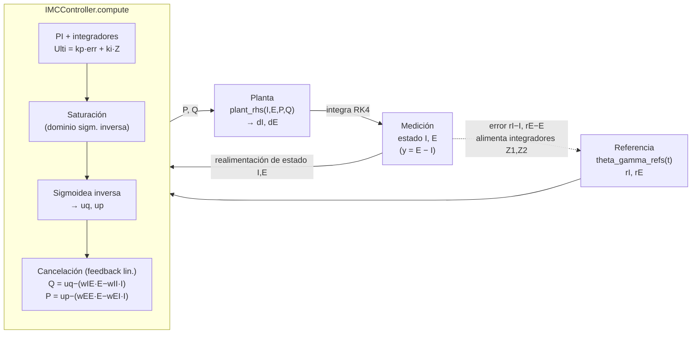

# P4 — `src/neural_ode`: dinámica, integración y control

**En una frase:** el paquete `neural_ode` es el que convierte el modelo de Wilson-Cowan identificado en una *planta* de estados —dada `[I,E]` y el control `[P,Q]` devuelve `[dI/dt, dE/dt]`—, la integra con un RK4 diferenciable, y la mete en un lazo cerrado con un controlador IMC que usa los pesos sinápticos para cancelar el acoplamiento; acá vive todo el bloque de *validación orientada al control* (OE3).

> [!info] Cómo encaja con el resto del paquete
> - **[[M5]]** (integración numérica / RK4 y Euler) da la teoría del integrador de `integrate.py`.
> - **[[B5]]** (régimen theta-gamma) explica por qué las referencias del lazo cerrado son senoides a 120 Hz.
> - **[[P0]]** (mapa del repo) ubica este paquete dentro del proyecto y su relación con `model.py`/`losses.py` (la PINN) y `gen_multi_dataset.py` (los datos).

---

## Idea general del paquete

El punto de partida es una diferencia conceptual con la PINN del resto del proyecto:

- La **PINN** aprende un mapa $t \mapsto [I,E]$ para un estímulo **fijo**. Sirve para identificar parámetros a partir de una trayectoria, pero no se puede meter en un lazo de control porque no sabe responder a un `P,Q` que cambia *online*.
- El **Neural ODE** de este paquete aprende un mapa de **estados**: dado el estado actual `[I,E]` y el control `[P,Q]`, devuelve la derivada `[dI/dt, dE/dt]`. Se integra paso a paso, así que sí se puede enchufar a un controlador que genera `P,Q` en tiempo real.

Es un modelo **gray-box**: el *backbone* tiene la estructura **exacta** de Wilson-Cowan (la misma de `model.py`/`losses.py`), y encima puede sumarse una **corrección neuronal** $g_\varphi$ (un MLP) que captura lo que el backbone no modela. Conservar la estructura WC no es un capricho: es **requisito** para que el controlador IMC (linealización por realimentación) pueda cancelar el acoplamiento usando los pesos.

**Convención de unidades (importante):** toda la cadena trabaja en **milisegundos**. La decisión viene desde `gen_multi_dataset.py` ("régimen ms"): el dataset, la identificación (`te=1 ms`, `ti=2 ms`; frecuencias en Hz convertidas a ciclos/ms vía `f/1000`) y este lazo cerrado (`tf=50 ms`, refs a 120 Hz = 0.12 ciclos/ms) usan la misma unidad. Los parámetros del modelo son numéricamente idénticos en ambos lados; lo único que cambia es el paso de integración (`dt≈0.05 ms` en identificación vs `dt=0.005 ms` en el lazo), que es una elección numérica, no de unidades. **No hay reescalado de parámetros.**

El paquete tiene cuatro archivos:

| Archivo | Rol |
|---|---|
| `dynamics.py` | La planta: `GrayBoxWC`, el modelo $\dot x = f_\theta(x,P,Q)$. |
| `integrate.py` | El integrador RK4 diferenciable: `rk4_step`, `rollout`. |
| `closed_loop.py` | El controlador IMC y el lazo cerrado completo. |
| `__init__.py` | Re-exporta la API pública del paquete. |

---

## `dynamics.py` — el modelo de dinámica

Define una única clase, `GrayBoxWC`, que es la planta $\dot x = f_\theta(x, P, Q)$.

### Variantes según los flags

El comportamiento se controla con flags del constructor:

- **V0 (white-box):** `use_correction=False`, `learnable_weights=False`. Son las ecuaciones de WC con los pesos dados, sin nada aprendido. Es la **planta de referencia** (la "verdad"). Con `learnable_weights=False` y `learnable_params=False` el objeto no tiene ningún parámetro entrenable: es básicamente unos ~10 escalares fijos (4 pesos + 6 físicos).
- **V1 (gray-box):** `use_correction=True`. WC + el MLP $g_\varphi$ que captura el residuo que el backbone no modela (la parte aprendida).

Los pesos y/o los parámetros físicos pueden ser adicionalmente entrenables (`learnable_weights`, `learnable_params`), lo que la vuelve utilizable también como modelo a identificar, no solo como planta fija.

### `class GrayBoxWC(nn.Module)`

**Atributos de clase**
- `WEIGHTS = ("wEE", "wEI", "wIE", "wII")` — los 4 pesos sinápticos.
- `EXTRA = ("te", "ti", "ae", "ai", "thetae", "thetai")` — los 6 parámetros "físicos" que también pueden identificarse. **`ke`, `ki` NO están acá**: no son libres, se derivan de `ae,thetae` / `ai,thetai` (los offsets de reposo del SPEC §4).

#### `__init__(self, fixed, w_init, learnable_weights=False, use_correction=False, learnable_params=False, hidden=32)`

**Qué hace:** arma el modelo según los flags.

**Entradas**
- `fixed: dict` — los físicos `te,ti,ae,ai,thetae,thetai` y los offsets `ke,ki` como floats.
- `w_init: dict` — valores iniciales de `wEE,wEI,wIE,wII` (p. ej. los identificados por la PINN).
- `learnable_weights: bool` — `True` → los 4 pesos se siguen ajustando por gradiente.
- `use_correction: bool` — `True` → agrega la corrección neuronal $g_\varphi$ (variante V1).
- `learnable_params: bool` — `True` → también aprende `te,ti,ae,ai,thetae,thetai`.
- `hidden: int` — ancho de las capas ocultas del MLP de corrección.

**Cómo lo arma (notas clave):**
- **Parámetros físicos.** Si `learnable_params=False` (defecto) se guardan como *buffers* (`te,ti,ae,ai,thetae,thetai,ke,ki`): constantes, no se entrenan. Si `learnable_params=True` se guardan "crudos" (`raw_*`) pasados por `inv_softplus` (`log(expm1(v))`), de modo que un `softplus` posterior los devuelve positivos; en ese caso `ke,ki` dejan de ser fijos y se **recalculan en cada `forward`** a partir de los `ae,thetae`/`ai,thetai` actuales, para que `E=I=0` siga siendo el reposo.
- **Pesos sinápticos.** Si `learnable_weights=True` se guardan crudos (`raw_w`, con `inv_softplus`, para forzar positividad). Si no, quedan como buffer `w_fixed`.
- **Corrección neuronal $g_\varphi$.** Si `use_correction=True`, un `Sequential`: `Linear(4→hidden) → Tanh → Linear(hidden→hidden) → Tanh → Linear(hidden→2)`. Entra `[I,E,P,Q]`, sale una corrección `[·,·]` para `[dI,dE]`. **Se inicializa en ~0** (biases en cero y peso de la última capa en cero) para que al arranque el modelo sea idéntico al backbone WC puro.

#### `weights(self) -> torch.Tensor`
Devuelve los 4 pesos **reales (positivos)**: `softplus(raw_w)` si son entrenables, o `w_fixed` si no. Salida: tensor de shape `(4,)` en orden `wEE,wEI,wIE,wII`.

#### `weights_dict(self) -> dict[str, float]`
Los mismos pesos pero `detach`-eados y como `dict` de floats con claves `WEIGHTS`. Útil para pasárselos al controlador (que los quiere como dict de floats).

#### `_extra(self, k: str) -> torch.Tensor`
Helper interno. Valor actual de un parámetro físico `k`: `softplus(raw_k)` si `learnable_params=True`, o el buffer `getattr(self,k)` si no.

#### `params_dict(self) -> dict[str, float]`
Todos los parámetros identificados como dict de floats: siempre los 4 pesos (`weights_dict`), y si `learnable_params=True`, además los 6 físicos. Es el "resultado" de identificación del modelo.

#### `forward(self, x, P, Q) -> torch.Tensor`

**Firma / la EDO:** $\dot x = f_\theta(x, P, Q)$.

**Entradas**
- `x: (...,2)` = `[I, E]` (inhibitoria, excitatoria).
- `P, Q` — tensores *broadcastables* a `(...,1)`; se expanden a la forma de `I` con `torch.as_tensor(...) * ones_like(I)`.

**Salida:** `(...,2)` = `[dI/dt, dE/dt]`.

**Qué calcula (misma estructura que `rhs()` en `model.py`, umbral adentro, offset `ke/ki`):**
$$u_i = w_{IE}E - w_{II}I + Q - \theta_i, \qquad u_e = w_{EE}E - w_{EI}I + P - \theta_e$$
$$\dot I = \tfrac{1}{\tau_i}\big(-I + \sigma(a_i\,u_i) - k_i\big), \qquad \dot E = \tfrac{1}{\tau_e}\big(-E + \sigma(a_e\,u_e) - k_e\big)$$
con $\sigma$ = sigmoidea. Si `learnable_params=True`, `ke,ki` se recalculan como `sigmoid(-ae·thetae)` y `sigmoid(-ai·thetai)`; si no, se usan los buffers. Si `use_correction=True`, suma `g([I,E,P,Q])` a `[dI,dE]`.

Esta forma coincide exactamente con las ecuaciones canónicas del SPEC §4.

---

## `integrate.py` — el integrador RK4 diferenciable

Dos funciones libres (no clases). Integran el modelo `f(x,P,Q)` en el tiempo con **Runge-Kutta 4 de paso fijo**. Tres propiedades que importan:

1. **No agrega dependencias** (no necesita `torchdiffeq`).
2. **Es diferenciable**: se puede entrenar el Neural ODE por *backprop a través del solver* (el gradiente fluye por los pasos RK4). Ver [[M5]] para la parte de por qué RK4 y no Euler.
3. El control `P,Q` se mantiene **constante durante cada paso** (*zero-order hold*), que es cómo llega un control muestreado.

> [!note] Multiple shooting
> El comentario del archivo aclara que para entrenar conviene *multiple shooting*: integrar en ventanas cortas reiniciando desde el estado observado, no de un tirón los 600 s. Estas dos funciones son los ladrillos para eso; el `train_ode.py` que las usaría se menciona como trabajo a futuro.

#### `rk4_step(f, x, P, Q, dt) -> torch.Tensor`

**Qué hace:** un paso de RK4.

**Entradas:** `f` = callable `f(x,P,Q)->dx`; `x` = estado; `P,Q` = control (constante en el paso, ZOH); `dt: float` = paso.

**Salida:** el estado avanzado un `dt`. Fórmula estándar:
$$x_{n+1} = x_n + \tfrac{dt}{6}(k_1 + 2k_2 + 2k_3 + k_4)$$
con `k1=f(x)`, `k2=f(x+½dt·k1)`, `k3=f(x+½dt·k2)`, `k4=f(x+dt·k3)`, todas evaluadas con el mismo `P,Q`.

#### `rollout(f, x0, P_seq, Q_seq, dt) -> torch.Tensor`

**Qué hace:** integra una trayectoria completa dado el estímulo muestreado, encadenando `rk4_step`.

**Entradas**
- `f` — el modelo de dinámica.
- `x0: (...,2)` — estado inicial.
- `P_seq, Q_seq: (T, ...,1)` — estímulo en cada uno de los `T` pasos.
- `dt: float` — paso.

**Salida:** `(T+1, ...,2)` con la trayectoria de estados, **incluyendo `x0`** como primer elemento.

---

## `closed_loop.py` — controlador IMC + planta + lazo cerrado

Es un *port* fiel a Python de `simulador_wilson_cowan_con_control.m` (el controlador que dio el tutor). Es el corazón del bloque de **validación orientada al control** (OE3): construir el controlador con los pesos **identificados** ($\hat\theta$) y correrlo contra la planta verdadera (o contra el modelo aprendido) para medir cuánto degrada el control el error de identificación. Resultado central del proyecto: la fragilidad para identificar `wII` **no se propaga** al control.

**Diseño desacoplado:** el controlador y la planta están separados. La planta es un *callable* `plant_rhs(I,E,P,Q)->(dI,dE)` que puede ser la WC verdadera o el Neural ODE aprendido. Así se enchufa el modelo aprendido sin tocar el controlador.

> [!warning] Realimentación de estado completo (no EKF)
> El archivo original usa realimentación de **estado completo** (`I,E` directos, sin filtro de Kalman). Se replica igual. El EKF del paper sería una capa extra, todavía no implementada acá.

### El lazo cerrado

El estado que se integra es el **aumentado** `[Z1, Z2, I, E]`: `Z1,Z2` son los integradores del controlador (acción integral), `I,E` la planta.

### `theta_gamma_refs(freq_hz=120.0, time_in_ms=True)`

**Qué hace:** fábrica que devuelve una función `refs(t) -> (rI, rE)` con las senoides del MATLAB (referencias del régimen theta-gamma, ver [[B5]]):
$$rI = 0.2\sin(2\pi f t - 0.94) + 0.25, \qquad rE = 0.3\sin(2\pi f t) + 0.45$$
Con `time_in_ms=True`, `f = freq_hz/1000` (ciclos por ms), coherente con la convención de ms de todo el paquete.

**Entradas:** `freq_hz` (defecto 120 Hz), `time_in_ms`.
**Salida:** un callable `refs(t)`.

### `class IMCController`

El controlador IMC con linealización por realimentación.

#### `__init__(self, fixed, weights, kp_I=10.0, ki_I=5.0, kp_E=5.0, ki_E=5.0, argmin=-100.0, argmax=100.0)`

**Entradas**
- `fixed: dict` — `ae,ai,thetae,thetai,ke,ki` (los que necesita la sigmoidea inversa).
- `weights: dict` — `wEE,wEI,wIE,wII`. **Estos son los pesos que usa la cancelación**: acá se meten los verdaderos o los identificados $\hat\theta$ según el experimento.
- `kp_I,ki_I` — ganancias PI del lazo de `I` (por defecto `Ulti_I = 10·err + 5·Z1`).
- `kp_E,ki_E` — ganancias PI del lazo de `E` (por defecto `Ulti_E = 5·err + 5·Z2`).
- `argmin,argmax` — extremos del argumento con los que se calculan los límites de saturación.

**Qué hace en el constructor:** guarda ganancias y pesos, y precalcula los **límites de saturación** `fim,fiM,fem,feM` — el dominio válido de la sigmoidea inversa, evaluando la sigmoidea directa en `argmin/argmax` (con un factor `0.99999` para no tocar la asíntota).

#### `compute(self, Z1, Z2, I, E, rI, rE) -> (P, Q, dZ1, dZ2)`

**Qué hace:** un paso del cálculo del control. Es la ley de control completa:

1. **PI:** `Ulti_I = kp_I·(rI−I) + ki_I·Z1`, ídem `Ulti_E`.
2. **Saturación** al dominio de la inversa: `Usat = min(max(Ulti, fim), fiM)`.
3. **Sigmoidea inversa** → `uq, up`: `uq = (−1/ai)·log(−1 + 1/(Usat_I+ki)) + thetai`, ídem `up`.
4. **Cancelación del acoplamiento** (feedback linearization, usa los pesos):
$$Q = u_q - (w_{IE}E - w_{II}I), \qquad P = u_p - (w_{EE}E - w_{EI}I)$$

**Salida:** `(P, Q, dZ1, dZ2)` con `dZ1 = rI−I`, `dZ2 = rE−E` (las derivadas de los integradores).

Este es el punto donde entran los pesos identificados: si $\hat\theta \neq \theta$, la cancelación es imperfecta y ahí se mide la degradación.

### Plantas: `plant_rhs(I,E,P,Q) -> (dI,dE)`

#### `make_true_plant(fixed, weights)`
**Qué hace:** fábrica que devuelve el `rhs` de la **Wilson-Cowan verdadera** (V0, la referencia), en aritmética escalar de Python (con `math.exp`). Misma estructura del SPEC §4.
**Entradas:** `fixed` (los físicos + `ke,ki`), `weights` (los 4 pesos).
**Salida:** callable `rhs(I,E,P,Q)->(dI,dE)`.

#### `make_neural_plant(model)`
**Qué hace:** fábrica que **envuelve un `GrayBoxWC`** (torch) como callable escalar, para que el lazo lo use igual que la planta verdadera. Adentro hace `torch.no_grad()`, arma el tensor `[[I,E]]` y devuelve floats. Así se valida el control contra el **modelo aprendido**.
**Entradas:** `model` (una instancia de `GrayBoxWC`).
**Salida:** callable `rhs(I,E,P,Q)->(dI,dE)`.

### `simulate_closed_loop(plant_rhs, controller, refs, t_span=(0.0,50.0), dt=0.005, x0=(0.0,0.0))`

**Qué hace:** integra el lazo cerrado completo con RK4 sobre el estado aumentado `[Z1,Z2,I,E]`.

**Entradas**
- `plant_rhs` — la planta (verdadera o neural).
- `controller: IMCController` — el controlador.
- `refs` — la función de referencias (típicamente de `theta_gamma_refs`).
- `t_span=(0.0,50.0)` — intervalo en ms.
- `dt=0.005` — paso (ms; más fino que en identificación, ver nota de unidades).
- `x0=(0.0,0.0)` — estado inicial de la planta `(I,E)`; los integradores `Z1,Z2` arrancan en 0.

**Cómo funciona:** define `aug_rhs(state,t)` que, dado el estado aumentado y `t`, evalúa las refs, llama a `controller.compute` para obtener `P,Q,dZ1,dZ2`, y luego `plant_rhs` para `dI,dE`; devuelve el vector `[dZ1,dZ2,dI,dE]` más `P,Q,rI,rE` para registro. El bucle registra el punto actual y da un paso RK4 (con las refs evaluadas en los sub-tiempos `t, t+½dt, t+dt`).

**Salida:** un `dict` de arrays numpy: `t, I, E, P, Q, rI, rE`, y además `y = E − I` (la salida observada del SPEC §4). Es lo que grafica `closed_loop_compare.png` (seguimiento con $\hat\theta$ vs pesos reales).

---

## `__init__.py` — API pública

Solo re-exporta lo utilizable desde `neural_ode`:
- de `dynamics`: `GrayBoxWC`;
- de `integrate`: `rk4_step`, `rollout`;
- de `closed_loop`: `IMCController`, `make_true_plant`, `make_neural_plant`, `simulate_closed_loop`, `theta_gamma_refs`.

El docstring del módulo recuerda que este paquete es la extensión orientada al control (OE3): el modelo aprendido usado como **planta** que responde a los estímulos `P,Q` del controlador.

---

## Estado del código (qué es sólido y qué es stub)

- `GrayBoxWC`, el integrador RK4 y el lazo cerrado están **completos y funcionales**.
- El **entrenamiento** del Neural ODE (`train_ode.py`, con multiple shooting) se menciona en los comentarios como **trabajo a futuro**: no está en este paquete. `rk4_step`/`rollout` son los ladrillos previstos para armarlo.
- El **EKF** (filtro de Kalman extendido del paper) **no está implementado**: el lazo usa realimentación de estado completo, tal como el MATLAB original.
