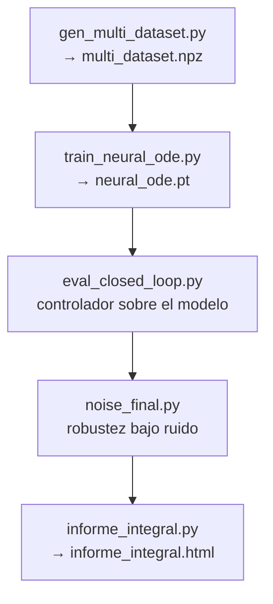

# P6 — `scripts/` — puntos de entrada

> **En una frase:** los archivos que se corren de verdad (uno por experimento o tarea), que usan la biblioteca `src/` para generar datos, identificar, diagnosticar, controlar y armar informes.

## Intro

Todo lo que está en `scripts/` son **puntos de entrada ejecutables**: se corren con

```bash
python scripts/<nombre>.py
```

desde la raíz del repo `wilson-cowan-id/`. La regla mental del proyecto es: **`src/` define las herramientas, `scripts/` las usa** (ver P0–P5 para el detalle de la biblioteca). Ningún script vive solo — todos importan de `src/wilson_cowan/`, `src/data/`, `src/pinn/`, `src/neural_ode/` o `src/utils/`.

Muchos scripts tienen una **"ZONA EDITABLE"** cerca del principio: un bloque de constantes (parámetros, estímulos, nº de trayectorias, σ de ruido, épocas, `dt`) pensado para tocar a mano sin meterse en la lógica. Si querés cambiar *qué* se corre, ese bloque es el lugar; si querés cambiar *cómo* se corre, tenés que ir a `src/` (ver P0–P5).

Abajo los agrupo **por propósito**. Los nombres son los reales del repo (se ignoró `__pycache__`).

---

## (1) Generación de datos

| Script | Qué hace | Genera / consume |
|---|---|---|
| `generate_data.py` | "Panel de control" para generar **una** trayectoria con parámetros a mano. | Genera un `.npz` de una trayectoria. |
| `gen_multi_dataset.py` | Genera el **dataset de control** multi-variante (≈20 trayectorias, todos los estímulos nuevos, régimen ms). | Genera `data/processed/control/multi_dataset.npz` → entrada del Neural ODE. |

## (2) Identificación con PINN

| Script | Qué hace | Genera / consume |
|---|---|---|
| `train_pinn.py` | PINN de **una** trayectoria (pasos 4.0/4.1/4.2: forward, inverso estable, inverso ignorante). | Consume un `.npz`; genera checkpoint + figuras. |
| `train_multi.py` | PINN **multi-trayectoria** con θ compartido — rompe la degeneración y recupera wII. | Consume varios `.npz`; genera θ̂ + figuras. |
| `pinn_joint_sweep.py` | PINN canónica conjunta (autograd + multi-trayectoria) con **barrido de ruido**. | Consume datasets; genera θ̂ por nivel de σ. |
| `train_wii.py` | Experimento dedicado a **wII** con el diseño **Q-grande**. | Consume `.npz` Q-grande; genera θ̂ de wII. |

## (3) Estímulos

| Script | Qué hace | Genera / consume |
|---|---|---|
| `compare_estimulos.py` | Compara familias de estímulo por **error paramétrico** (identifica con cada una). | Consume/genera datasets por familia; tabla de error. |
| `demo_estimulos.py` | Demo de **cobertura del espacio de estados** por estímulo (retratos de fase). | Genera `demo_estimulos.png`. |
| `graficos_estimulos.py` | Gráficos **antes vs ahora** de los estímulos + respuesta del sistema. | Genera figuras de estímulos. |

## (4) Neural ODE y control

| Script | Qué hace | Genera / consume |
|---|---|---|
| `train_neural_ode.py` | Entrena el Neural ODE (multiple shooting) sobre el dataset de control — caso **4 pesos**. | Consume `multi_dataset.npz`; genera `results/models/neural_ode.pt`. |
| `train_neural_ode_full.py` | Igual que el anterior pero **identificación completa (10 params)** desde arranque ignorante (no se le regalan los físicos). | Consume dataset multi-escenario; genera modelo + θ̂ (10). |
| `eval_closed_loop.py` | Corre el **lazo cerrado**: controlador IMC sobre planta verdadera y aprendida, con pesos reales o θ̂. | Consume el modelo entrenado; genera `closed_loop_compare.png`. |
| `eval_full_identified.py` | Evalúa el modelo **completo (10 params)** en lazo **abierto** (rollout vs real) **y cerrado** (IMC). | Consume θ̂ (10); genera figuras de evaluación. |
| `evaluate.py` | Evaluación / figuras auxiliares de un checkpoint. | Consume checkpoint; genera figuras. |

## (5) Robustez al ruido

| Script | Qué hace | Genera / consume |
|---|---|---|
| `noise_sweep.py` | Barrido de ruido de la **PINN** (método de dos etapas + FD). | Genera error(σ) de la PINN. |
| `noise_robustness.py` | Ruido en la cadena **Neural ODE → control** (método ingenuo). | Genera error(σ) sobre la cadena. |
| `noise_improve.py` | Diagnóstico: qué palanca (suavizado / estímulo fuerte) mejora θ̂ a ruido alto. | Consume datasets ruidosos; tabla de palancas. |
| `noise_refine.py` | Refinamiento del suavizado a ruido alto (k=7 vs 11, set XL). | Genera θ̂ refinado. |
| `noise_final.py` | Barrido **final** con suavizado **adaptativo** (mejor resultado). | Genera el error(σ) final. |
| `noise_full_sweep.py` | Robustez al ruido de la **identificación completa (10 params)** + propagación al control. | Consume 12 escenarios; genera `noise_param_error.png` + datos de propagación. |

## (6) Identificabilidad (Fisher / subset / regularización / OED)

| Script | Qué hace | Genera / consume |
|---|---|---|
| `fisher_identifiability.py` | Diagnóstico **FIM + SVD** de los 10 params: predice qué se recupera **sin entrenar** (wII el peor). | Genera `valle_plano_svd_fim.png` + ranking de sensibilidad. |
| `ident_subset.py` | **Herramienta compartida**: identifica los 10 fijando / regularizando un subconjunto (subset selection / profile-likelihood / MAP ridge). | Importada por los `exp_*` de remedios. |
| `exp_fix_regularize.py` | **Experimento A**: fijar / regularizar el mal condicionado (wII); barrido de λ. | Genera `expA1_fix_wII.png`, `expA2_reg_lambda.png`. |
| `exp_subset_selection.py` | **Experimento B**: qué conviene fijar (QR con pivoteo sobre la FIM). | Genera `expB_heatmap_fijar.png`. |
| `exp_input_design.py` | **Experimento C**: identificabilidad dependiente del estímulo (OED, FIM por `jacfwd`, **sin entrenar**). | Genera `oed_cond_por_estimulo.png`. |
| `exp_mix_test.py` | **Experimento C3**: mezcla de estímulos que cubre direcciones complementarias. | Consume mezcla; genera error paramétrico. |
| `exp_oed_weighted.py` | **OED ponderado al cuello de botella**: barrido de ρ (Q-alta vs decorrelación) → V-shape. | Genera `oed_weighted.png`. |
| `exp_family_neural_ode.py` | Identificación NODE (10 params) **por familia** de estímulo; límite del dt grande. | Genera JSON por familia. |
| `exp_compute_cost.py` | **Costo computacional** del Neural ODE (rigidez, barrido dt × solver; **sin entrenar**). | Genera `cost_dt_sweep.png`. |
| `exp_learning_curve.py` | **Curva de aprendizaje**: ¿cuántos datos hacen falta? (costo de datos). | Genera error vs tamaño de dataset. |
| `run_ident_experiments.py` | **Orquestador**: corre A + B + C3 en secuencia (pensado para background). | Dispara los `exp_*`; junta JSON + figuras. |

## (7) Informes (generan HTML)

| Script | Qué hace | Genera / consume |
|---|---|---|
| `informe_neural_ode.py` | Simulador vs Neural ODE (lazo abierto y cerrado). | Genera `docs/informe_neural_ode.html`. |
| `informe_integral.py` | **Informe integral** de todo el trabajo. | Genera `docs/informe_integral.html`. |

## (8) Datos reales / figuras sueltas / otros

| Script | Qué hace | Genera / consume |
|---|---|---|
| `load_real_data.py` | Convierte **datos reales** (`data8_filtered.mat` → `.npz`). | Consume `.mat`; genera `.npz`. |
| `train_real_output.py` | Identificación WC **por salida** (LFP, datos reales) con multiple shooting y estado latente por ventana. | Consume el `.npz` real; genera θ̂. |
| `plot_fit_chirp.py` | Figura del ajuste (θ̂ vs real) sobre trayectoria de test **chirp** — **no reentrena**. | Genera `fit_chirp_test.png`. |
| `plot_noise_robustness.py` | Figura de error por parámetro vs σ (10 params) — **no reentrena**. | Regenera `noise_param_error.png`. |
| `plot_family_compare.py` | Figura dt grande vs dt fino por familia — solo grafica, lee los JSON. | Genera `family_compare_dt.png`. |
| `plot_pinn_vs_node.py` | Diagrama PINN vs Neural ODE (prototipo matplotlib). | Genera `pinn_vs_node.png`. |
| `plot_valle_plano.py` | Diagrama conceptual del **"valle plano"** de la verosimilitud (SVD/FIM → wII). | Genera figura conceptual del valle. |

---

## Flujo típico (cómo se encadenan)



La rama PINN corre en paralelo: generar trayectorias → `train_multi.py` / `train_wii.py` (identifica θ) → `compare_estimulos.py` (compara estímulos). La rama de identificabilidad arranca de `fisher_identifiability.py` (diagnóstico sin entrenar) y sigue con los `exp_*` de remedios, orquestados por `run_ident_experiments.py`.

---

## Mapa: experimento (4.1–4.8) ↔ script ↔ figura ↔ resultado clave

| Experimento (informe §4) | Script(s) | Figura | Resultado clave |
|---|---|---|---|
| **4.1** Simulador y datasets (OE1) | `generate_data.py`, `gen_multi_dataset.py`, `demo_estimulos.py` | `demo_estimulos.png` | Cerebro de mentira + datasets; la diversidad de estímulos da excitación persistente. |
| **4.2** Identificación en limpio (4 → 10) | `train_multi.py`, `train_neural_ode.py`, `train_neural_ode_full.py` | `fit_chirp_test.png` | 4 pesos casi perfectos (NODE 0.42 %); 10 params con error máx 1.14 %. |
| **4.3** Robustez al ruido + Fisher+SVD ⭐ | `fisher_identifiability.py`, `noise_full_sweep.py`, `noise_final.py` | `valle_plano_svd_fim.png`, `noise_param_error.png` | La FIM predice wII **sin entrenar**; el ruido lo confirma (0.8 % → 41 % a σ=0.10). |
| **4.4** Remedios: subset / regularización / OED ⭐ | `exp_fix_regularize.py`, `exp_subset_selection.py`, `exp_input_design.py`, `ident_subset.py`, `run_ident_experiments.py` | `expA2_reg_lambda.png`, `oed_cond_por_estimulo.png` | Fijar wII baja el error del resto 15.9 % → 9.7 %; regularizar da el continuo (λ→∞ ≡ fijar). |
| **4.5** OED ponderado al cuello de botella ⭐ | `exp_oed_weighted.py` | `oed_weighted.png` | V-shape con óptimo en ρ=0.5 → wII 18.7 % (vs 93 % / 98.7 % en los extremos). |
| **4.6** Identificación por familia y límite del dt | `exp_family_neural_ode.py`, `plot_family_compare.py` | `family_compare_dt.png` | No concluyente; lo firme: dt grande solo es seguro con estímulos suaves. |
| **4.7** Costo computacional | `exp_compute_cost.py` | `cost_dt_sweep.png` | WC no es rígido (\|λ_max\|≈0.70) → RK4 con dt grande ≈ 5× más barato; la rigidez lo predice sin correr nada. |
| **4.8** Validación orientada al control (OE3) ⭐ | `eval_closed_loop.py`, `eval_full_identified.py` | `closed_loop_compare.png` | RMSE casi idéntico con θ̂ vs reales aun con wII degradado → la fragilidad **no se propaga** al control. |

---

## Cierre — dónde seguir

- **M5 / M6** — teoría matemática de identificabilidad (Fisher, SVD, Cramér-Rao) y de OED / costo que explican *por qué* los scripts de los grupos (6) y (7) hacen lo que hacen.
- **B5** — la biología del régimen theta-gamma y la motivación de los estímulos realizables con optogenética.
- **P0–P5** — la biblioteca `src/` que estos scripts orquestan: el modelo y los estímulos (P1), datasets (P2), PINN (P3), Neural ODE y control (P4), utils (P5).
