# Informe — Wilson-Cowan: identificación paramétrica orientada al control

> **Qué es esto:** el informe consolidado del proyecto. Explica **cada experimento** (objetivo, motivación, hipótesis, teoría relevante, resultado y novedad), con figuras y tablas. Es el documento narrativo; el detalle de cada resultado vive en su nota, linkeada. Para armar la presentación ver Presentación al tutor - resumen y plan de armado.
> **Teoría de fondo (PDF):** Fundamentos matemáticos · Neural ODE y PINN · nota viva: Fundamentos teóricos - Identificabilidad, SVD, Fisher y OED.

## Resumen ejecutivo
Identificamos los **10 parámetros** del modelo de Wilson–Cowan (WC) desde datos sintéticos con ruido usando una **Neural ODE**, diagnosticamos con **Fisher + SVD** qué se puede recuperar (**wII** es el cuello de botella), aplicamos **métodos establecidos** (selección de subconjuntos, regularización, diseño de estímulo) para mitigarlo, y mostramos que **la fragilidad de la identificación NO se propaga al control en lazo cerrado**. Las piezas metodológicas son prestadas y citadas; el **aporte** es la aplicación a WC + el hallazgo (wII) + la validación orientada al control.

---

## 1 · Motivación y objetivos
El proyecto vive en el cruce de **neurociencia computacional** y **machine learning científico (SciML)**, con validación **orientada al control**. Wilson–Cowan modela dos poblaciones neuronales (excitatoria **E**, inhibitoria **I**) que generan ritmos; ver Modelo Wilson-Cowan. Queremos **identificar sus parámetros** (interpretables) desde datos, no solo reproducir su dinámica, para **alimentar un controlador**.

- **OE1** — Simulador de WC + datasets sintéticos con ruido.
- **OE2** — Identificación con **dos arquitecturas comparadas** (PINN y Neural ODE) + baseline clásico.
- **OE3** — Validación orientada al control: conectar el modelo identificado al controlador IMC y ver si preserva el ritmo bajo ruido. *(La variación paramétrica quedó descartada: el tutor confirmó que el modelo es tiempo-invariante.)*

---

## 2 · Fundamentos teóricos 
El hilo conductor de todo el análisis de identificabilidad es una sola matriz: la **sensibilidad** $J=\partial y/\partial\theta$ (cómo cambia la trayectoria al mover cada parámetro), y su **SVD**.
- **FIM (matriz de información de Fisher)** $=J^\top J/\sigma_\varepsilon^2$: cuánta información traen los datos sobre $\theta$. Sus **autovalores** son los **valores singulares de $J$ al cuadrado**; un autovalor chico = **dirección plana** = parámetro (o combinación) no identificable.
- **Cota de Cramér–Rao** $\mathrm{std}(\hat\theta_j)\ge\sigma_\varepsilon\sqrt{[(J^\top J)^{-1}]_{jj}}$: el mejor error posible; la métrica **correcta** de identificabilidad marginal
- **OED (diseño de experimentos)**: la FIM depende del estímulo → elegir el estímulo es elegir la información.

Este diagrama resume el *porqué* de la no-identificabilidad de wII:
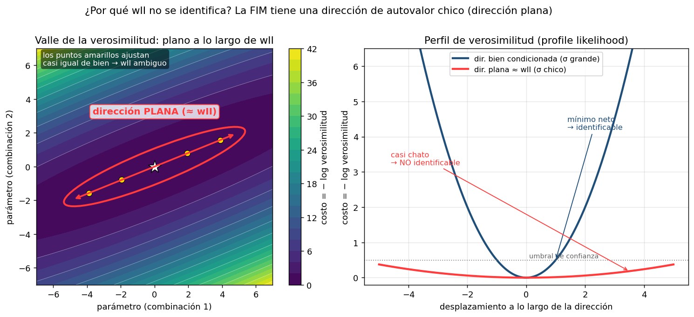
> Cerca del óptimo el costo es una cuadrática cuyo Hessiano **es la FIM**. Un autovalor chico → **valle plano** (≈ wII): muchos $\hat\theta$ ajustan casi igual de bien. Detalle: Identificabilidad (Fisher + SVD) - explicación visual y Fundamentos teóricos - Identificabilidad, SVD, Fisher y OED.

---

## 3 · Métodos: PINN vs Neural ODE (OE2)
Dos arquitecturas de SciML + un baseline clásico (*derivative matching* tipo SINDy, que estima derivadas de los datos → sensible al ruido). Ver PINN vs Neural ODE.

|                           | **PINN**                             | **Neural ODE**                         |
| ------------------------- | ------------------------------------ | -------------------------------------- |
| Qué aprende               | la **solución** $t\mapsto x$         | la **dinámica** $(x,P,Q)\mapsto\dot x$ |
| Derivadas                 | autograd en $t$ (no estima de datos) | integración numérica (RK4)             |
| Estímulo                  | **fijo**                             | **variable / en línea**                |
| Uso en control            | ❌ no (no puede ser planta)           | ✅ sí (gemelo digital / planta)         |
| Params identificados aquí | 4 pesos(falta probar los 10)         | **10 params**                          |
| Costo dominante           | tamaño de red                        | integración (NFE)                      |
| Robustez al ruido         | suaviza nativamente                  | vía suavizado + ventanas               |
| Error en limpio (wII)     | ≤ 1.7 % (4 pesos)                    | 0.42 % (4 pesos) · 1.14 % máx (10)     |

> Ambas **evitan estimar derivadas de los datos** → más robustas al ruido que el baseline clásico. Teoría: Neural ODE y PINN (PDF) · Neural ODEs.

**PINN** — mapea el tiempo a la solución (estímulo fijo, no sirve de planta, evita estimar derivadas de datos):
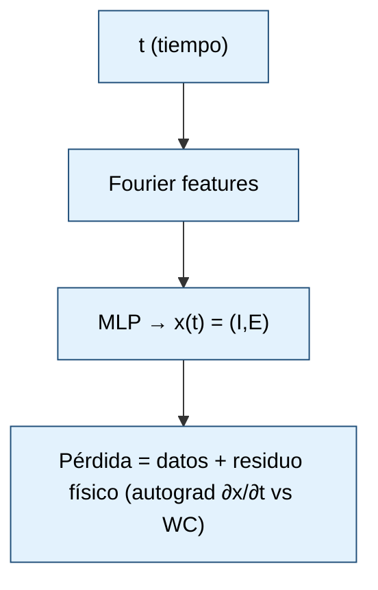

**Neural ODE** — aprende la dinámica e integra (estímulo variable, es el gemelo digital / planta, aprende los 10 params):
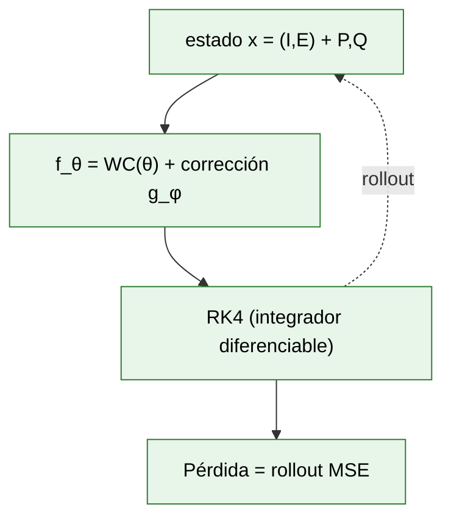
> Estilos de diagrama comparados: Diagramas - prueba de estilos (PINN vs NODE).

---

## 4 · Experimentos

### 4.1 · Simulador y datasets (OE1)
> **📐 Specs.** Dataset de control `multi_dataset.npz` = **19 trayectorias × 2000 pasos** (864 KB). Datasets de identificación: **12 escenarios** (8 train / 4 test), **4000 pasos** c/u (T=(0, 200), dt≈0.05), ~140 KB por `.npz` (≈15 MB los 32 juntos). Integración de generación: RK45 adaptativo.

**Objetivo:** generar el "cerebro de mentira" y datasets con distintos estímulos y ruido.
**Método:** WC integrado con RK45; librería de estímulos (pulsos, chirp, APRBS, PRBS, theta-gamma, Poisson, onda cuadrada), P a E y Q a I.
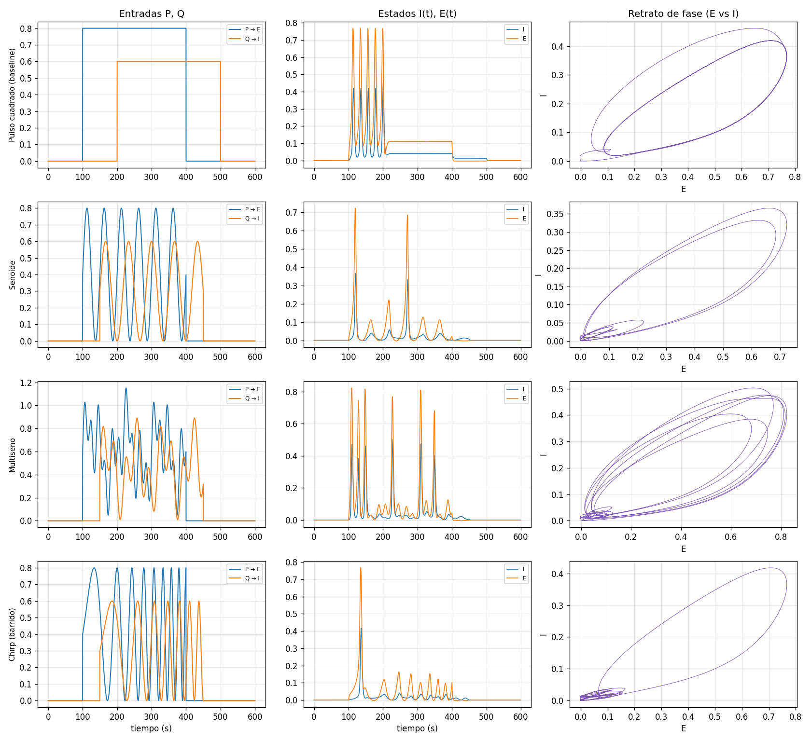
> La diversidad de estímulos importa por **excitación persistente** (Ljung): distintas entradas vuelven identificables distintos parámetros.

### 4.2 · Identificación en limpio (4 pesos → 10 params)
> **📐 Specs.** Neural ODE 4 pesos: **3000 épocas** + L-BFGS 50, ventana de multiple shooting = 100 pasos. Neural ODE 10 params (`train_neural_ode_full`): **2000 épocas** (converge ~1250) + L-BFGS 80. PINN 4 pesos: MLP **64×4** + **128 Fourier features**, **20 000 épocas** + L-BFGS 50. Rollout MSE open-loop: 4 pesos test ≈ **8.5e-5**; 10 params **train 2.8e-5 / test held-out 5.5e-4**. Dataset limpio: **20 trayectorias** (13 train / 7 test).

**Objetivo:** recuperar los parámetros de WC desde trayectorias limpias.
**Motivación:** es la base a no empeorar; primer test de que las arquitecturas funcionan.
**Hipótesis:** con excitación rica y multi-trayectoria, los 4 pesos son identificables con error bajo.
**Resultado:** los **4 pesos** se identifican casi perfecto (NODE 0.42 %, PINN ≤ 1.7 %); extendido a los **10 params** con la Neural ODE desde arranque ignorante → **error máx 1.14 %**. Ver Resultado - Identificación completa 10 parámetros.
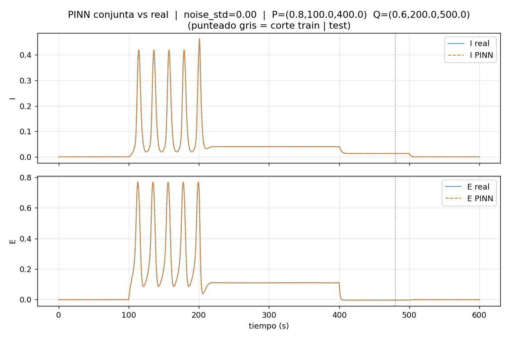
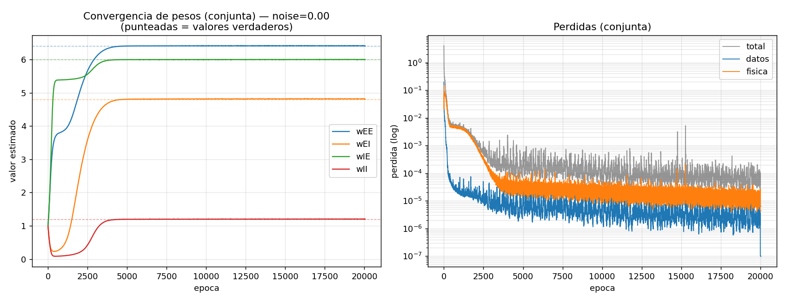
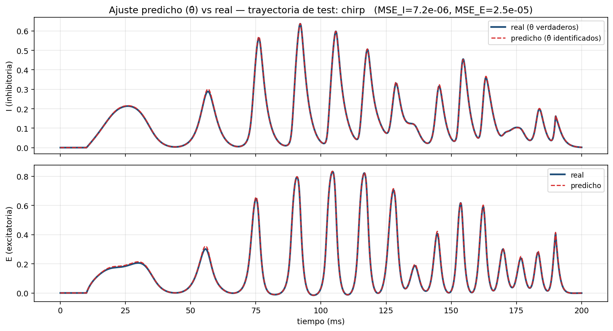
> *Reconstrucción (no es el rollout crudo de la red):* WC con los **parámetros identificados** vs WC verdadero, sobre una trayectoria de test **chirp** (estímulo no visto en entrenamiento). El solapamiento casi total ilustra la **calidad de la identificación limpia** (todos los θ̂ a ≤1.14 %). Se simula con los θ̂ documentados porque el checkpoint de la red no se conservó (ver pendiente de reproducibilidad del dataset).

**Novedad:** identificar los **10 parámetros** de WC con una Neural ODE (no solo los 4 pesos) — no lo encontramos hecho en la literatura.

### 4.3 · Robustez al ruido + diagnóstico Fisher+SVD ⭐
> **📐 Specs.** `strong_scenarios` = **12 trayectorias** (8 train / 4 test), **4000 pasos** (dt≈0.05), multiple shooting WINDOW=100 → **~312 ventanas** de train. **1500 épocas** + L-BFGS 30–40. Barrido σ ∈ {0, 0.01, 0.05, 0.10}, suavizado adaptativo (k = 7 → 11).

**Objetivo:** ¿qué se puede recuperar bajo ruido de observación?
**Motivación:** los datos reales tienen ruido; la degradación **no es uniforme** entre parámetros.
**Hipótesis (predicha por la FIM, *antes* de entrenar):** existe una dirección plana dominada por **wII** (con acoples $a_e$–$\tau_e$–$w_{EE}$ y $a_i$–$\tau_i$–$\theta_i$) → wII será el peor.
**Teoría:** FIM + SVD + Cramér–Rao (§2). **Método:** barrido de σ; suavizado adaptativo + estímulo fuerte (Q grande).
**Resultado:** la predicción se **confirma** casi exacta. Identificando los **10 parámetros con la Neural ODE**, la degradación bajo ruido es **muy no uniforme** y sigue el ranking de la FIM:
- **wII es el peor a todos los niveles:** 0.8 % → **41 %** a σ=0.10 (la dirección singular más débil).
- Le siguen los de los acoples que marcó la SVD: **ti** 15.9 %, **ai** 11.5 %, **ae** 9.1 %.
- Los **mejor identificados** son **wIE** (1.2 %), **wEE** (3.3 %) y **thetae** (4.0 %) — también como anticipó la sensibilidad.

Además, **identificar 10 params es mucho menos robusto que identificar 4:** a σ=0.10 el error máx de los 10 es **41 %** (wII) vs **8.9 %** si solo se estiman los 4 pesos — liberar ai/ti/thetai (que compiten con wII en la ecuación de I) le "roba" identificabilidad. Ver Resultado - Robustez al ruido (10 params).
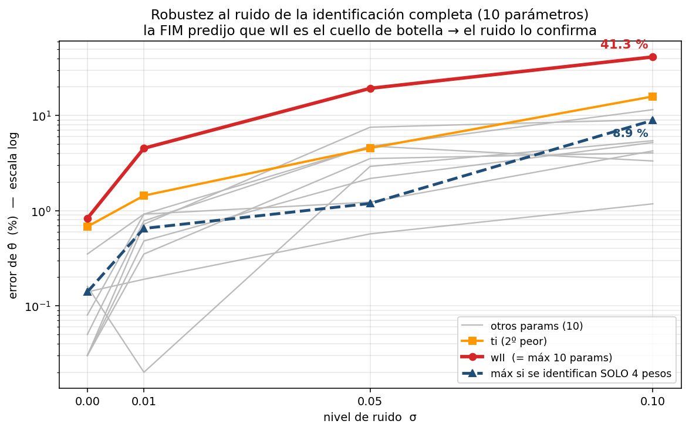
**Novedad:** el bucle **predecir → confirmar** (la FIM anticipa wII *sin entrenar*, el ruido lo verifica) sobre WC identificado con Neural ODE.

### 4.4 · Remedios guiados por FIM: subset selection, regularización, OED ⭐
> **📐 Specs.** `identify_subset` sobre los **12 escenarios**, 4000 pasos, WINDOW=100, **1500 épocas** + L-BFGS 40, σ=0.10. Exp C (OED por familia): **sin entrenar** — FIM por autograd (`jacfwd`, 10 columnas) sobre **7 familias** de estímulo.

**Objetivo:** mitigar la mala identificabilidad de wII.
**Motivación:** si una dirección es plana, hay que **fijarla/regularizarla** o **cambiar el estímulo**.
**Hipótesis:** fijar el parámetro mal condicionado libera al resto; los estímulos de banda ancha condicionan mejor la FIM.
**Teoría:** *parameter subset selection* (QR con pivoteo), regularización de Tikhonov/MAP ($\lambda\to\infty\equiv$ fijar), OED (A/D/E-óptimo). Ver Fundamentos matemáticos (PDF). **Resultado** en Resultado - Subset selection, regularización y diseño de estímulo:
- **(A) Fijar / regularizar wII** — *fijar* = mantener wII clavado en su **valor verdadero** (que conocemos en el setup sintético) y re-identificar los otros 9; *regularizar* = penalizar (L2) su alejamiento de ese valor con fuerza λ. **Fijar** baja el error del resto a σ=0.10 de **15.9 % → 9.7 %** (los que más mejoran son ti, ai, thetai). **Regularizar** da el **continuo** entre libre y fijo: el error del resto baja monótono con λ y **satura en el mismo 9.7 %** (λ→∞ ≡ fijar); λ óptimo ≈ 1.0.
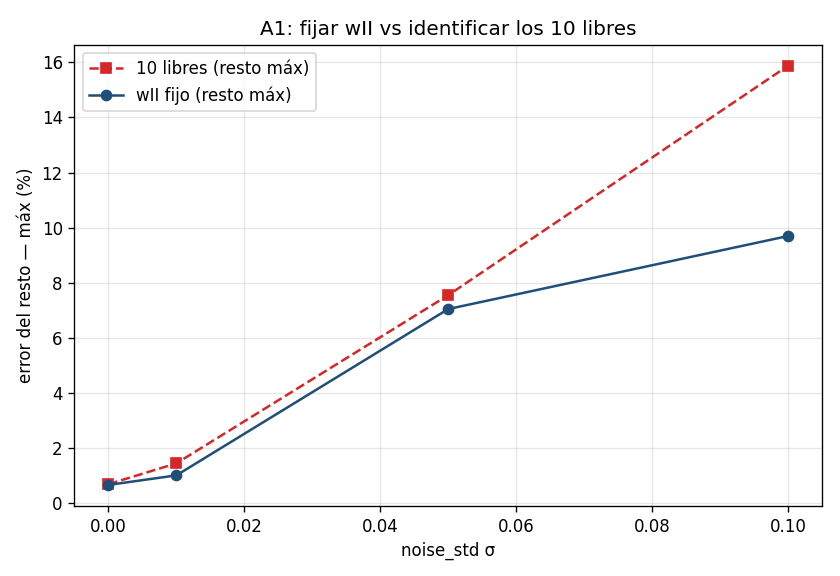
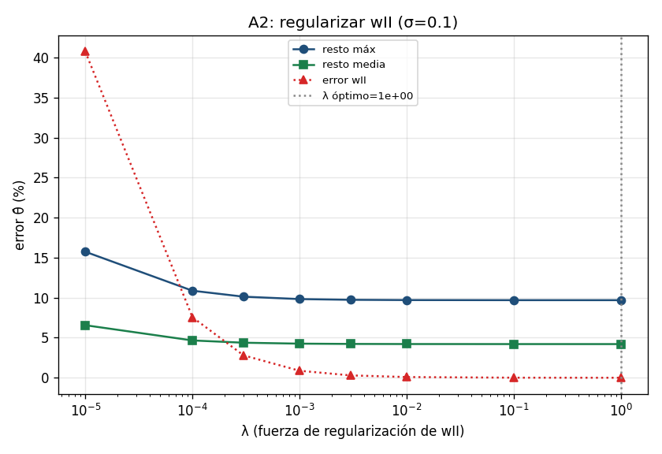
- **(B) Qué fijar (QR-pivoteo):** fijar **wII o ai** ≈ óptimo; fijar **ae** inútil; fijar **wII+ai** juntos **contraproducente** (99.7 %) → *fijar un representante mínimo del acople, no varios*.
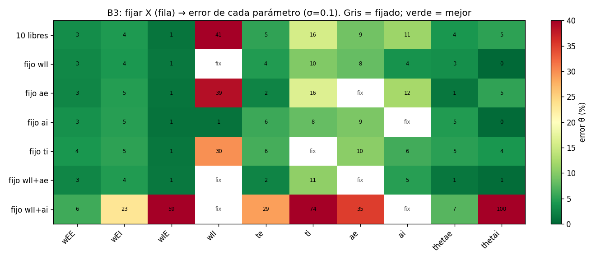
- **(C) OED por familia:** broadband (chirp/Poisson) ≫ box/square por **decorrelación**; métrica correcta = **Cramér–Rao**, no ‖columna‖.
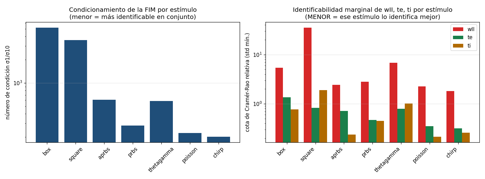
**Antecedentes:** Chu & Hahn 2007 (subset selection), Raue 2009 (profile likelihood), Ljung 1999 / Plate 2024 (OED). **Novedad:** primera aplicación de este arsenal sobre **WC + Neural ODE**, con el hallazgo concreto (wII) y receta accionable.

### 4.5 · OED ponderado al cuello de botella ⭐
> **📐 Specs.** **8 trayectorias** chirp por dataset, dt grande (**N_EVAL=1000**, dt≈0.2), WINDOW=25, **1500 épocas** + L-BFGS 40, σ=0.10. Barrido: **5 proporciones × 3 semillas = 15 corridas** (~70 min con throttling). *Caveat:* las semillas salieron redundantes (sin barras de error reales).

**Objetivo:** diseñar el dataset que mejor identifica wII.
**Motivación:** el Exp C dejó abierto que *el OED debe ponderar hacia el cuello de botella, no solo repartir cobertura*.
**Conceptos (qué significan acá):**
> - **Ponderar hacia el cuello de botella** = diseñar el dataset para mejorar *el parámetro peor identificado* (wII), en lugar de repartir el esfuerzo uniformemente entre todos.
> - **Decorrelación** = usar estímulos (chirp con P y Q en **bandas de frecuencia distintas**) que hagan que **E e I NO se muevan juntos**. Si E≈I (correlacionados), los términos de acople $w_{IE}E$ y $w_{II}I$ quedan casi colineales y el ajuste **no los distingue**; decorrelarlos los separa. → **ayuda a separar wII de wIE**.
> - **Q-alta** = amplitud grande en el estímulo Q (entrada a la población I). Como wII multiplica a I, excitar fuerte a I hace que wII **deje más huella** en la trayectoria. → **mejora el SNR / la observabilidad de wII**.
> En una frase: **decorrelación separa, Q-alta hace visible.** Hacen falta las dos.

**Hipótesis:** hay un balance óptimo **intermedio**; ni solo decorrelación (wII poco visible) ni solo Q-alta (wII colineal con wIE) alcanzan.
**Método:** barrido de la proporción ρ = fracción de trayectorias Q-alta vs de decorrelación; componentes **suaves (chirp)** para conservar el dt grande; σ=0.10. Ver Resultado - OED ponderado al cuello de botella.
**Resultado:** **V-shape con óptimo en ρ=0.5** (4 Q-alta + 4 decorrelación) → wII **18.7 %**, vs **93 %** (solo decorrelación) y **98.7 %** (solo Q-alta). Confirma que hacen falta las dos.
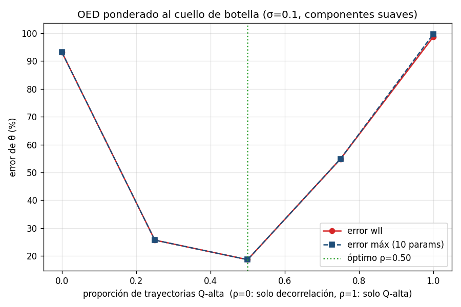

**Cómo mejorar el experimento (y resultado esperado):**
> 1. **Versión realizable con optogenética:** repetir con estímulos **conmutados** (PRBS/APRBS para decorrelación + tren de pulsos de gran amplitud para Q-alta) + **dt fino** (los conmutados rompen a dt grande). *Esperado:* la V-shape persiste (óptimo intermedio) aunque desplazada, y ya sería un protocolo implementable con luz.
> 2. **Barras de error reales:** variar la realización del ruido entre corridas (las semillas actuales salieron redundantes). *Esperado:* confirmar que el óptimo en ρ≈0.5 es robusto, no ruido de optimización.
> 3. **Grilla más fina de ρ** cerca de 0.5 para localizar mejor el óptimo.

**Novedad:** usa métodos de **diseño óptimo de experimentos / excitación persistente** (Ljung 1999; Plate 2024) **aplicados a** la identificación de Wilson–Cowan con Neural ODE, **con** la ponderación explícita hacia el parámetro cuello de botella (wII) y su verificación empírica (V-shape). *Limitación:* el chirp no es realizable con optogenética (on/off).

### 4.6 · Identificación por familia y el límite del dt grande
> **📐 Specs.** **5 familias × 4 trayectorias**, **1500 épocas** + L-BFGS 40, σ=0.05. Dos corridas: dt grande (N_EVAL=1000, WINDOW=25, ~20 min) y dt fino (N_EVAL=4000, WINDOW=100, ~65 min).

**Objetivo:** ¿confirma la NODE (entrenando por familia) el ranking de identificabilidad que predijo la CRB?
**Motivación:** cerrar el triángulo PINN-por-familia + NODE-sobre-mezcla + OED.
**Resultado: NO concluyente.** A dt grande solo el chirp (suave) identificó; a dt fino se recuperaron aprbs/theta-gamma pero chirp empeoró → **varianza de optimización** alta + estímulos no comparables a los de la CRB. Ver Resultado - Identificación NODE por familia y el límite del dt grande.
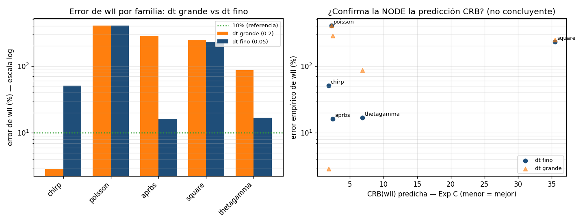
**Lo firme:** el **dt grande solo es seguro para estímulos suaves**; los conmutados necesitan dt fino (rigor metodológico: cazamos el confusor).

### 4.7 · Costo computacional
> **📐 Specs.** **No entrena** — integra la dinámica conocida (álgebra + autograd). Referencia scipy RK45 (rtol=1e-11, **3001 puntos**); barrido dt ∈ {0.05 … 2.0} × solvers Euler / RK2 / RK4; rigidez = autovalores de ∂f/∂x en 200 puntos de la trayectoria.

**Objetivo:** ¿cuánto cuesta y cómo se abarata sin perder calidad? ¿hay un estimador a-priori del costo, como Fisher+SVD lo es de la identificabilidad?
**Hipótesis:** sí — la **rigidez** (autovalores del Jacobiano de estado $\partial f/\partial x$) predice el paso de integración estable → el costo.

**Dónde está el cuello de botella (por arquitectura):**
- **Neural ODE** → la **integración**, no la red. Con `use_correction=False` el "modelo" son **~10 escalares** (backbone WC) → costo de red despreciable. Cada época integra por rollout, así que el costo lo da el **NFE** (nº de evaluaciones de $f$). Si se activa el gray-box, la corrección es un MLP 4→32→32→2 = **1 282 params** (recién ahí la red pesa).
- **PINN** → la **red**, no la integración (no integra). El costo lo dan las evaluaciones de la MLP (**~30 k params**: 64×4 + 128 Fourier features) en los puntos de colocación **más el autograd del residuo físico** ($\partial x_\theta/\partial t$). Además usa **20 000 épocas** (vs 1500–3000 del NODE) → su cuello es el volumen de evaluaciones de red + derivadas.

**La matemática (concisa):**
- **NFE de entrenamiento** = $4_{\text{(RK4)}}\times(\text{pasos por ventana})\times(\text{nº ventanas})\times(\text{épocas})$.
- **Memoria** del backprop a través del solver $\propto$ pasos × ventanas → por eso el *multiple shooting* (ventanas cortas) la acota.
- **Rigidez:** el paso explícito estable cumple $\Delta t\cdot|\lambda_{\max}|\lesssim 2.78$ (región de estabilidad de RK4 sobre el eje real). En WC $|\lambda_{\max}|\approx0.70$ → **$\Delta t$ estable ≈ $2.78/0.70\approx4.0$**. Y como el **ratio** $|\lambda_{\max}|/|\lambda_{\min}|\approx1$ (nada rígido), no hay transitorios a los que "adaptarse" → el paso adaptativo **casi no gana** frente a un paso fijo grande.

**Tamaño de los datos (para dimensionar):**
- Datasets de identificación: **12 escenarios × 4000 pasos × 4 señales (I,E,P,Q)** ≈ **1.5 MB** en memoria (float64); ~140 KB por `.npz`, **~15 MB** los 32 juntos. Multiple shooting WINDOW=100 → **39 ventanas/trayectoria** → ~312 ventanas de train.
- Dataset de control: **19 trayectorias × 2000 pasos = 864 KB**.
- Redes: NODE white-box **~10 escalares**; PINN **~30 k params**.

**Qué fuimos optimizando (antes → después):**

| Palanca | Antes | Después | Efecto |
|---|---|---|---|
| $\Delta t$ de integración | 0.05 (N_EVAL 4000) | **0.2** (N_EVAL 1000), estímulos suaves | 4× menos pasos |
| Tiempo por época (medido) | ~510 ms | **~140 ms** | ~3.7× más rápido |
| Épocas (NODE 10 params) | 6000 | **2000** (converge ~1250) | 3× menos épocas |
| Red (identificación pura) | — | `use_correction=False` (~10 escalares) | costo de red ≈ 0 |
| Solver | RK4 fijo | RK4 fijo (adaptativo evaluado: no aporta, WC no es rígido) | — |

> **Límite del $\Delta t$ grande:** solo sirve con estímulos **suaves** (chirp); los **conmutados** (on/off) necesitan $\Delta t$ fino (ver 4.6).

**Resultado clave:** WC **no es rígido** ($|\lambda_{\max}|\approx0.70$) → RK4 con $\Delta t$ grande (**NFE 600**) da la misma precisión que el adaptativo (**nfev 3050**) a tolerancia práctica → **~5× más barato**, y la rigidez lo predice **sin correr nada**.
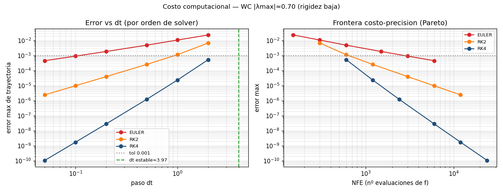
**Novedad conceptual:** la **rigidez** es el gemelo computacional del número de condición de la FIM — una predice **costo**, la otra **identificabilidad**; ambas son espectros de un Jacobiano ($\partial f/\partial x$ vs $\partial y/\partial\theta$). Detalle: Costo computacional del Neural ODE - qué reducir y cómo estimarlo.

### 4.8 · Validación orientada al control (OE3) ⭐
> **📐 Specs.** Lazo cerrado RK4, **dt=0.005 ms, tf=50 ms → ~10 000 pasos**. Matriz **2×2** {simulador, Neural ODE} × {θ̂, real} + barrido de ruido σ ∈ {0, 0.01, 0.05, 0.10}.

**Objetivo:** ¿sirven los θ̂ identificados para controlar? ¿la fragilidad de la identificación rompe el control?
**Motivación:** es el objetivo final del proyecto — la cadena identificar → controlar.
**Hipótesis:** la **acción integral** del IMC absorbe el error de modelo → el control es más robusto que la identificación.
**Teoría:** IMC con linealización por realimentación; la cancelación usa los pesos (θ̂), la realimentación integral **no**. Ver Controlador IMC - cómo funciona y por qué es robusto.
**Resultado:** RMSE de seguimiento **casi idéntico** con θ̂ vs reales, y ~ideal **aun con θ̂ muy degradado bajo ruido** (p. ej. wII lejos de su valor) → **la fragilidad NO se propaga**. Ver Control en lazo cerrado (IMC).
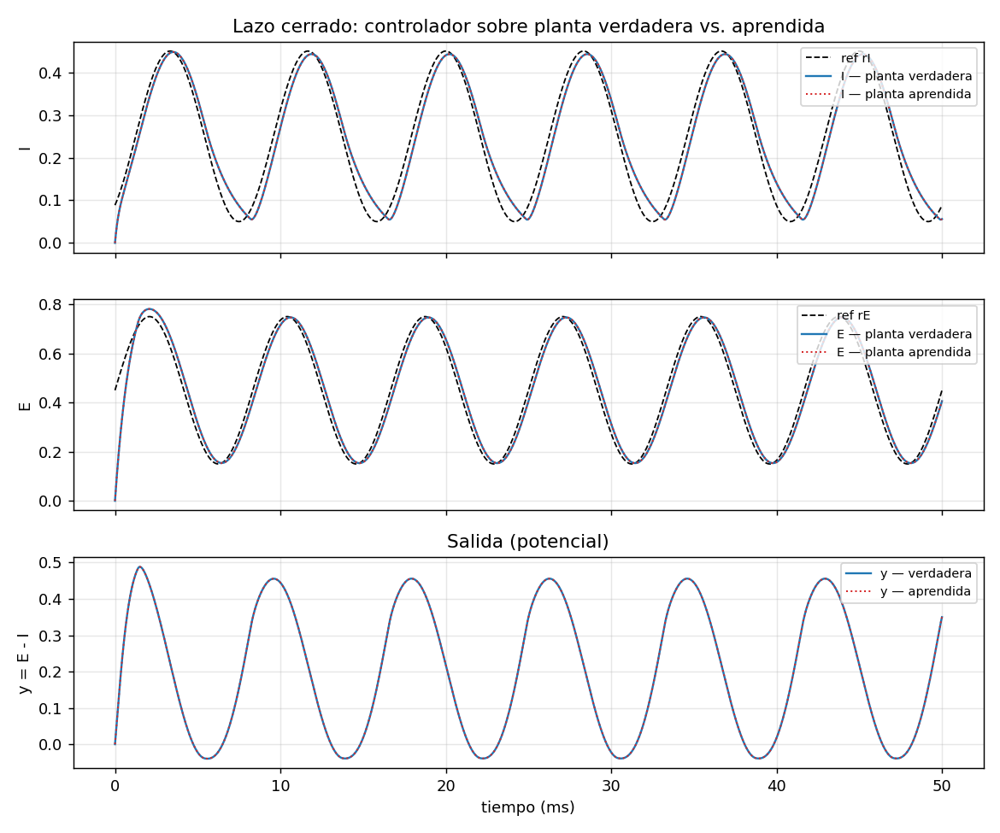
**Novedad:** cuantificar end-to-end que la fragilidad de la identificación (wII) **no llega al control** — da vuelta la lectura pesimista del cuello de botella.

---

## 5 · Novedad y trabajo relacionado
Detalle y tabla en Novedad y trabajo relacionado. En una frase: *somos, hasta donde vimos, el primer trabajo que identifica los 10 parámetros de Wilson–Cowan con una Neural ODE, diagnostica con Fisher+SVD qué se recupera (wII el límite), y demuestra que la fragilidad de la identificación no se propaga al control en lazo cerrado.*

**Encuadre honesto (plantilla):** *usa métodos de **X** (de [referencia]) aplicados a **Y** con [cambio/novedad]*. Los métodos son prestados y citados; el aporte es la combinación y la aplicación:
- **Identificabilidad:** métodos de **Fisher + SVD, subset selection y profile likelihood** (Golub & Van Loan; Chu & Hahn 2007; Raue 2009) **aplicados a** Wilson–Cowan identificado con Neural ODE, **con** el hallazgo de que **wII** es el cuello de botella (predicho sin entrenar y confirmado con ruido).
- **Diseño de estímulo:** métodos de **OED / excitación persistente** (Ljung 1999; Plate 2024) **aplicados a** WC, **con** la ponderación explícita hacia el cuello de botella (V-shape).
- **Modelado:** **Neural ODE gray-box / UDE** (Chen 2018; Rackauckas 2020) **aplicado a** los **10 parámetros** de WC (no solo los 4 pesos), **con** validación orientada al control.
- **Aporte global** = la **combinación** + el **hallazgo (wII)** + que la **fragilidad no se propaga al control**.
- **Antecedente más cercano a diferenciar:** Adaptive Stimulus Design (PMC6349832) — estímulos óptimos para un RNN neuronal (otro modelo, sin control).
- ⚠️ Búsqueda acotada → confirmar con búsqueda sistemática y con el tutor.

---

## 6 · Qué sigue
- **OED ponderado realizable:** repetir con estímulos **conmutados** (optogenética) + dt fino + realización de ruido variable (barras de error).
- **Gray-box real** (`use_correction=True`) + **modelo de observación (LFP)** para datos que no son WC puro (Eje 5).
- **Cerrar OE2:** comparación PINN vs Neural ODE bajo ruido (requiere extender la PINN a 10 params).
Ver Plan de trabajo - Neural ODE.

---

## 📐 Apéndice — especificaciones consolidadas
| Experimento | Dataset | Iteraciones (Adam + L-BFGS) | Notas |
|---|---|---|---|
| Ident. limpia — NODE 4 pesos | 19 tray × 2000 pasos (864 KB) | 3000 + 50 | WINDOW=100 |
| Ident. limpia — NODE 10 params | multi-escenario, 4000 pasos | 2000 + 80 | converge ~ép. 1250 |
| Ident. limpia — PINN 4 pesos | multi-trayectoria | 20 000 + 50 | MLP 64×4 + 128 Fourier |
| Robustez al ruido (10 params) | 12 tray (8 train/4 test), 4000 pasos | 1500 + 30–40 | σ∈{0…0.10}; ~312 ventanas |
| Subset selection / regularización | 12 escenarios, 4000 pasos | 1500 + 40 | σ=0.10, WINDOW=100 |
| OED por familia (Exp C) | 7 familias de estímulo | **sin entrenar** (FIM/`jacfwd`) | 10 columnas de sensibilidad |
| OED ponderado | 8 tray chirp, N_EVAL=1000 (dt≈0.2) | 1500 + 40 | 5 ρ × 3 seeds = 15 corridas, σ=0.10 |
| Familia + límite de dt | 5 fam × 4 tray | 1500 + 40 | dt 0.2 (~20') y 0.05 (~65'), σ=0.05 |
| Costo computacional | — (dinámica conocida) | **sin entrenar** | RK45 ref. 3001 pts; barrido dt×solver |
| Control (OE3) | lazo dt=0.005 ms, tf=50 ms | — (~10 000 pasos RK4) | matriz 2×2 planta×params |

> **Común a las identificaciones:** WC en régimen ms (te=1, ti=2 ms); reparametrización softplus (positividad) + ke,ki derivados; `use_correction=False` (white-box, ~10 escalares); multiple shooting; integrador RK4 diferenciable.

## 7 · Material y referencias
- **Teoría (LaTeX/PDF):** Fundamentos matemáticos · Neural ODE y PINN (fuente en `Desktop/teoria-wilson-cowan/`).
- **Notas de resultado:** Resultado - Identificación completa 10 parámetros · Resultado - Robustez al ruido (10 params) · Resultado - Subset selection, regularización y diseño de estímulo · Resultado - OED ponderado al cuello de botella · Resultado - Identificación NODE por familia y el límite del dt grande
- **Teoría/conceptos:** Fundamentos teóricos - Identificabilidad, SVD, Fisher y OED · Identificabilidad (Fisher + SVD) - explicación visual · Costo computacional del Neural ODE - qué reducir y cómo estimarlo
- **Control:** Control en lazo cerrado (IMC) · Controlador IMC - cómo funciona y por qué es robusto
- **Diagramas / presentación:** Diagramas - Pipelines Wilson-Cowan · Storyboard · Presentación al tutor - resumen y plan de armado
- **Bibliografía anotada:** Bibliografía del proyecto - Wilson-Cowan ID
- **Código / informe técnico vivo:** `wilson-cowan-id/docs/informe_completo.md`
