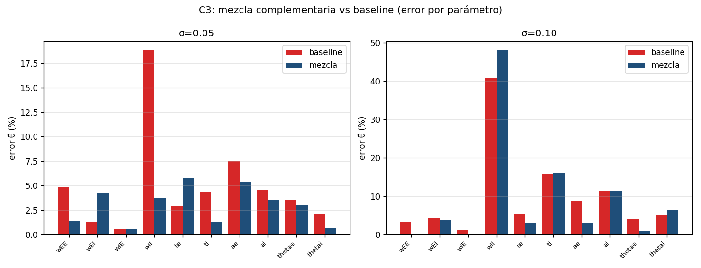

# Subset selection, regularización y diseño de estímulo para la identificación completa

> Ante la mala identificabilidad de la identificación completa (10 parámetros) bajo
> ruido —wII se rompe al 41% a σ=0.10 (ver
> [robustez_ruido_identificacion_completa.md](robustez_ruido_identificacion_completa.md))—
> se prueban tres remedios de la literatura de identificación: **(A)** fijar/regularizar
> el parámetro mal condicionado, **(B)** selección de subconjunto identificable guiada
> por la Fisher, y **(C)** diseño de estímulo (optimal input design). Todos los métodos
> son prestados; acá se implementan y se miden sobre Wilson-Cowan.

---

## 1. Motivación

El diagnóstico Fisher+SVD mostró que **wII domina la dirección singular más débil** (σ₁₀)
y el barrido de ruido lo confirmó: identificando los 10 parámetros libres, wII llega a
**41% de error a σ=0.10**, arrastrando a los parámetros con los que se acopla (ti, ai, ae).
El control no se degrada (la acción integral absorbe el error), pero la *identificación*
sí. Las preguntas de esta sesión:

- **A.** ¿Sacar wII del ajuste (fijarlo o regularizarlo) mejora la identificación del resto?
- **B.** ¿Qué conviene fijar, y a quién ayuda? (¿lo predice la Fisher?)
- **C.** ¿El estímulo cambia la identificabilidad? ¿Hay una mezcla mejor?

Se mantiene `use_correction=False` (identificación pura, datos WC).

## 2. Método

Toda la maquinaria se reutiliza:
- **`scripts/ident_subset.py`** (nuevo): identifica los 10 params fijando un subconjunto
  (en su valor verdadero, vía máscara de gradiente) o regularizándolo hacia un prior con
  penalización L2. Reutiliza `generate`/`smooth`/`strong_scenarios` (`noise_improve.py`),
  `make_windows` (`train_neural_ode.py`) y `GrayBoxWC`/`rollout` (`neural_ode`).
- **FIM+SVD**: `scripts/fisher_identifiability.py` (jacobiano forward, sensibilidad relativa).
- Baseline "10 libres": `results/noise_full_sweep.json`.
- Suavizado adaptativo (k crece con σ; `noise_final.py`) y excitación fuerte (`strong_scenarios`).

Los métodos son estándar (ver §6): **subset selection** (Chu & Hahn 2007; QR con pivoteo,
Golub & Van Loan), **profile likelihood / MAP-ridge** (Raue et al. 2009; Tikhonov) y
**optimal experiment design** (Franceschini & Macchietto 2008; Ljung 1999).

---

## 3. Experimento A — Fijar / regularizar wII

### A1 — Fijar wII (parameter subset selection)

Se fija wII en su valor verdadero y se re-identifican los otros 9, bajo el barrido de ruido.
Error del **resto** (máx sobre los 9), comparado con identificar los 10 libres:

| σ | resto máx (10 libres) | resto máx (wII fijo) |
|---|-----------------------|----------------------|
| 0.00 | 0.68% | 0.65% |
| 0.01 | 1.44% | 1.00% |
| 0.05 | 7.54% | 7.04% |
| 0.10 | **15.88%** | **9.69%** |

**Sí, fijar wII ayuda al resto bajo ruido**, y ayuda a los parámetros que la FIM señaló como
acoplados con wII. A σ=0.10 (error θ̂ por parámetro):

| Parámetro | 10 libres | wII fijo |
|-----------|-----------|----------|
| `ti` | 15.88% | **9.69%** |
| `ai` | 11.53% | **3.72%** |
| `thetai` | 5.21% | **0.28%** |
| `ae` | 9.05% | 8.07% |
| `te` | 5.44% | 4.44% |

La mejora es máxima en **ti, ai, thetai** — los parámetros de la ecuación de I, que competían
con wII. `ae` (que vive en la ecuación de E) casi no cambia. En limpio (σ=0) el efecto es
nulo, como se espera: todo es identificable sin ruido.


### A2 — Regularizar wII (MAP / ridge)

En vez de fijar, se penaliza `λ·(wII − prior)²` (prior = valor nominal). A σ=0.10:

| λ | error wII | resto media | resto máx |
|---|-----------|-------------|-----------|
| 0 (10 libres) | 40.74% | 6.56% | 15.74% |
| 1e-4 | 7.56% | 4.66% | 10.87% |
| 1e-3 | 0.87% | 4.26% | 9.83% |
| 1e-2 | 0.09% | 4.21% | 9.71% |
| **1.0 (óptimo)** | **0.00%** | **4.21%** | **9.69%** |

El error del resto **baja monótonamente** con λ y satura en el mismo valor que fijar wII
(9.69%). Es el resultado esperado: **en el límite λ→∞, regularizar equivale a fijar (A1)**.
La regularización da el control continuo entre "10 libres" (λ=0, alta varianza de wII que
contamina) y "wII fijo" (λ→∞). λ óptimo ≈ 1.0.


---

## 4. Experimento B — Qué fijar para mejorar cuáles (subset selection por FIM)

### B1 — Selección de subconjunto identificable

**QR con pivoteo de columnas** sobre la matriz de sensibilidad relativa (el pivoteo ordena
los parámetros de más a menos identificable; Golub & Van Loan; Chu & Hahn 2007):

```
identificabilidad (MÁS → MENOS):
  thetae > wIE > wEE > thetai > te > ti > ai > wEI > ae > wII
```

**wII queda último** (el menos identificable); la cola (candidatos a fijar) es **wEI, ae, wII**.
Coincide con la **dirección singular más débil** de la SVD (número de condición 1.18e3):

```
σ10 dominada por:  wII (+0.92)  ae (+0.23)  te (+0.20)  ai (+0.15)
```

### B2/B3 — Fijar candidatos y medir el resto (σ=0.10)

Error del resto (máx) al fijar distintos candidatos:

| Config | resto máx | wII | ti | ai | ae |
|--------|-----------|-----|----|----|----|
| 10 libres | 40.74% | 40.7 | 15.7 | 11.4 | 8.9 |
| **fijo wII** | **9.69%** | — | 9.7 | 3.7 | 8.1 |
| **fijo ai** | **9.41%** | 1.0 | 8.1 | — | 9.4 |
| fijo ti | 29.69% | 29.7 | — | 6.1 | 10.5 |
| fijo ae | 38.60% | 38.6 | 16.4 | 12.1 | — |
| fijo wII+ae | 10.65% | — | 10.7 | 4.8 | — |
| fijo wII+ai | **99.69%** | — | 73.5 | — | 35.1 |


**Lecturas (tabla "qué fijar → a quién ayuda"):**

1. **Fijar wII o ai da casi lo mismo (~9.5%)** y es lo más rentable. Ambos viven en la
   ecuación de I (`σ(ai·(wIE·E − wII·I + Q − θi))`): sacar cualquiera rompe el acople ai↔wII.
   Notablemente, **fijar ai recupera wII al 1%** (se vuelve identificable al quitar su competidor).
2. **Fijar ae no ayuda** (38.6%): ae está en el acople de la *otra* ecuación (ae↔te↔wEE), no en
   la dirección débil dominante. Fijar el parámetro equivocado no sirve — la FIM lo anticipa.
3. **Fijar de más es contraproducente**: fijar **wII+ai juntos** dispara el error a **99.7%**
   (ti explota a 73%). Los dos están en la misma dirección débil; fijar ambos sobre-restringe la
   ecuación de I y empuja todo el desajuste (con datos suavizados/ruidosos) a ti. **Lección de
   subset selection: fijar un representante MÍNIMO del acople débil, no varios.**

La predicción de la FIM (B1) se cumple: los candidatos útiles a fijar (wII, ai) están en la
dirección singular débil; fijar fuera de ella (ae) no ayuda.

---

## 5. Experimento C — Identificabilidad dependiente del estímulo (OED)

### C1/C2 — FIM por familia de estímulo (sin entrenar)

Para cada familia se calcula la FIM+SVD sobre trayectorias limpias. **Número de condición**
(menor = más identificable en conjunto):

| chirp | poisson | prbs | thetagamma | aprbs | square | box |
|-------|---------|------|------------|-------|--------|-----|
| **2.0e2** | 2.3e2 | 2.8e2 | 5.8e2 | 6.1e2 | 3.6e3 | **5.2e3** |

En **todas** las familias la dirección más débil está dominada por wII (+0.96 a +1.00).

**Cota de Cramér-Rao relativa** (diagonal de FIM⁻¹; menor = ese estímulo identifica mejor ese
parámetro — tiene en cuenta las correlaciones, a diferencia de la sensibilidad marginal):

| Parámetro | mejor estímulo | ranking (CRB, menor→mayor) |
|-----------|----------------|----------------------------|
| `wII` | **chirp** | chirp 1.81 < poisson 2.25 < aprbs 2.43 < prbs 2.82 < box 5.41 < thetagamma 6.86 < square 35.5 |
| `te` | **chirp** | chirp 0.32 < poisson 0.35 < prbs 0.47 < aprbs 0.72 < … < box 1.35 |
| `ti` | **poisson** | poisson 0.21 < aprbs 0.24 < chirp 0.26 < prbs 0.45 < … < square 1.89 |


**Hallazgo:** los estímulos **broadband/aperiódicos (chirp, poisson, aprbs, prbs)** son los más
identificables; **box y square son los peores**, a pesar de que box mete la señal más grande. La
lección de OED: lo que importa no es la amplitud de la sensibilidad sino que las direcciones
estén **decorrelacionadas**. Box excita un ciclo límite grande pero con E≈I correlacionados (la
métrica ingenua `‖columna‖` se dejaba engañar por eso; se corrigió a la CRB, que es la base de
los criterios A/D-optimal). **chirp es el mejor para wII y te; poisson para ti.**

### C3 — Mezcla complementaria bajo ruido

Se arma una mezcla (Q-grande para wII + chirp broadband para te,ti + theta-gamma + cobertura
general) y se compara contra el baseline `strong_scenarios`:

| σ | baseline (máx) | mezcla (máx) | wII base→mix | ae base→mix | te base→mix |
|---|----------------|--------------|--------------|-------------|-------------|
| 0.05 | 18.82% | **5.80%** | 18.8 → **3.8** | 7.6 → 5.4 | 2.9 → 5.8 |
| 0.10 | **40.74%** | 48.04% | 40.7 → 48.0 | 8.9 → **3.0** | 5.3 → **2.9** |



**Resultado matizado (honesto):**
- A **σ=0.05 la mezcla gana claramente** (máx 18.8% → 5.8%; wII 18.8% → 3.8%): cubrir direcciones
  complementarias mejora la identificabilidad conjunta, como predice OED.
- A **σ=0.10 la mezcla NO mejora wII** (48% vs 40.7%), aunque sí mejora ae y te. A ruido extremo,
  el cuello de botella (wII) necesita **excitación Q-alta concentrada**, y el baseline tenía más
  trayectorias de Q muy grande que la mezcla (8 vs 12 trayectorias). La cobertura amplia ayuda al
  resto pero no a la dirección más débil.

**Lección:** el diseño de estímulo debe **ponderar hacia la dirección cuello de botella**, no solo
repartir cobertura uniformemente. A ruido moderado, decorrelar (mezcla) domina; a ruido extremo,
maximizar el SNR del parámetro más débil (Q-alta para wII) domina.

---

## 6. Conclusiones

1. **Fijar/regularizar el parámetro mal condicionado funciona.** Fijar wII baja el error del resto
   a σ=0.10 de 15.9% a 9.7% (ti, ai, thetai son los que más mejoran). Regularizar da el mismo
   resultado en el límite (λ→∞ = fijar), con λ óptimo ≈ 1.0.
2. **La FIM predice qué fijar.** QR-pivoteo y SVD coinciden: wII (y ai, que comparte su dirección
   débil) son los candidatos. Fijar fuera de la dirección débil (ae) no ayuda; fijar de más
   (wII+ai) es contraproducente. Hay que fijar un representante **mínimo**.
3. **La identificabilidad depende del estímulo.** Broadband/aperiódico (chirp, poisson, prbs) >
   box/square, por decorrelación de sensibilidades (número de condición y CRB, no amplitud).
4. **La mezcla ayuda a ruido moderado pero no resuelve el cuello de botella a ruido extremo**: wII
   necesita excitación Q-alta específica. El OED óptimo pondera hacia la dirección más débil.

Todo consistente con el diagnóstico previo: **wII es el cuello de botella estructural** de la
identificación completa, y los tres remedios (fijar, regularizar, diseñar el estímulo) atacan la
misma dirección singular débil que la FIM señaló sin entrenar.

## 7. Métodos prestados (citas)

- **Parameter subset selection**: Chu, Y. & Hahn, J. (2007), *Parameter set selection for
  estimation of nonlinear dynamic systems*, AIChE J. — selección por sensibilidad/ortogonalización.
  QR con pivoteo de columnas: Golub & Van Loan, *Matrix Computations*. También Quaiser &
  Mönnigmann (2009), Yao et al. (2003).
- **Profile likelihood / identificabilidad**: Raue, A. et al. (2009), *Structural and practical
  identifiability analysis... profile likelihood*, Bioinformatics. Regularización L2 = Tikhonov /
  estimación MAP con prior gaussiano.
- **Optimal experiment design (OED)**: Franceschini, G. & Macchietto, S. (2008), *Model-based
  design of experiments for parameter precision*, Chem. Eng. Sci. (criterios A/D-optimal sobre la
  FIM). Ljung, L. (1999), *System Identification*, cap. 13 (input design, excitación persistente).
  Cota de Cramér-Rao: FIM⁻¹.
- **FIM+SVD para UDEs/Neural ODEs**: Plate et al. (2024), OED para universal differential equations
  (ya usado en `fisher_identifiability.py`).

## 8. Archivos

- Módulo compartido: `scripts/ident_subset.py`
- Exp A (fijar/regularizar): `scripts/exp_fix_regularize.py` → `results/exp_fix_regularize.json`,
  `results/figures/expA1_fix_wII.png`, `results/figures/expA2_reg_lambda.png`
- Exp B (subset selection): `scripts/exp_subset_selection.py` → `results/exp_subset_selection.json`,
  `results/figures/expB_heatmap_fijar.png`
- Exp C1/C2 (OED por estímulo): `scripts/exp_input_design.py` →
  `results/figures/oed_cond_por_estimulo.png`
- Exp C3 (mezcla): `scripts/exp_mix_test.py` → `results/exp_mix_test.json`,
  `results/figures/expC3_mezcla.png`
- Orquestador (corre A+B+C3 de un tirón): `scripts/run_ident_experiments.py`
